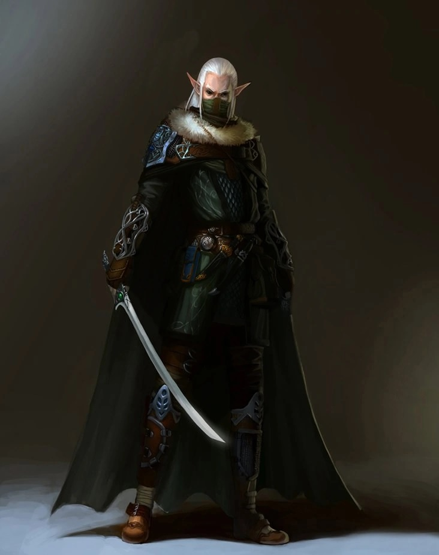

# Daelar Caerdonell

[DnDbeyond.com link](https://www.dndbeyond.com/characters/23831987)

{:width="300px"}

## Characteristics

- Alignment: Neutral Good
- Gender: Male
- Eyes: Brown
- Size: Medium
- Height: 5'5" (165cm)
- Faith: /
- Hair: Depending on the season (Silver)
- Skin: Bronze
- Age: 162
- Weight: n.a.

## Personality

### Traits

I always have a plan for what to do when things go wrong.
The first thing I do in a new place is note the locations of everything valuable—or where such things could be hidden.

### Ideals

People. I’m loyal to my friends, not to any ideals, and everyone else can take a trip down the Styx for all I care. (Neutral)

### Bonds

Someone I loved died because of a mistake I made. That will never happen again.

### Flaws

If there’s a plan, I’ll forget it. If I don’t forget it, I’ll ignore it.

## Backstory

I am an explorer of the dark and forgotten places of the world, places few others would be willing to delve. Ancient tombs and pyramids buried beneath the sand, forgotten subterranean temples and the maze-like sprawl of caverns that once made up a lost civilization.

During my encounters I uncovered many treasures as well as helped a lot of people to find their lost loves/sons/daughters/...

One encounter in the mines of phandelver did not end well and I ended up losing the love of my life. After this tragic event, I have been trying to find a group of adventurers to call family again.

## A fitting end

Tijdens het gevecht met de draak ben ik ten onder gegaan.  
Mijn lichaam is net voor het sterven nog in mijn herfst fase gegaan.  
Volgende fysieke kenmerken zijn er aan mijn karakter:
- lange oranje (herfstkleurige) haren
- een bronzen huidskleur
- hazelnoot kleurige ogen
- een glimlach op mijn gezicht

In mijn backstory heb ik het volgende vermeld:

> One encounter in the mines of phandelver did not end well and I ended up losing the love of my life.
> After this tragic event, I have been trying to find a group of adventurers to call family again.

De groep begon echt als een familie aan te voelen en daarom dat ik op het einde geen spijt heb van mijn daden en avonturen.

Als iemand naar het lichaam van **Daelar** gaat zien ze bovenstaande fysieke aanpassingen en dat ik een hand als een gesloten vuist op mijn borstkast heb liggen alsof ik iets vast heb

Wanneer iemand het onderzoekt zien ze een cirkelvormig medaillon met erin een portret van een vrouwlijke elf.

Als ze het medaillon verder onderzoeken kunnen ze een naam in het elvish zien staan:

> My one love, Elanalue Faejyre

Iemand met kennis van elven/eladrin weet dat we van the feywild komen en dat **Elanalue** een dochter is van een van de Eternal Eldritch Knights (warriors of the Eternal Court only become full Eternal Eldritch Knights after vanquishing a Great Evil. This is called The Great Hunt.) genaamd: **Vuduin**

De eladrin geloven dat de dood een kleine set-back is.  
Ongeacht van hoeveel we dood gaan, we zullen nooit verdwijnen omdat onze herinneringen bij onze ziel blijven.  
Ooit zullen we hergeboren worden met al onze herinneringen intact maar in een nieuw lichaam.  
Zo ook Daelar.  
Het enige waar de eladrin schrik voor hebben is dat hun lichaam overgenomen kan worden door een [changeling](https://en.wikipedia.org/wiki/Changeling). Die zou allerlei kwaad kunnen doen.  
Om dit te vermijden moet het lichaam naar de fey teruggebracht worden of gecremeerd.
