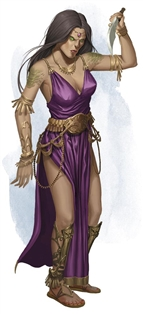
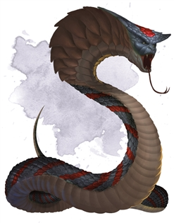

# Session 10

Date of session: **03/11/2021**

- [X] Anthony (**Jasper**)
- [X] Carl (**Alvyn**)
- [X] Martijn (**Svenn**)
- [X] Tom (**Sargon**)

**Disclaimer**: geen spellcheck of grammar check

## Alchemist supply room (15d)

**Slitherswamp**? Dat is de naam van deze plek.

We staan in een kamer met alchemy supplies waar **Alvyn** zijn gang kan gaan.

Ziet **Alvyn** nog notities? Nee helaas niks, geen secret notes ofzo.  

## Scouting With Tal

We zien een grote moerassige plas, met een verhoogske.
In een opening komt allemaal Stoom.  
Daarin staat een vrouwlijke *Deurgar* en twee *nagas*

## Ambush time

De *Deurgar* zegt dat we moeten stoppen.  
We horen geslither van achter haar:  

> Hebben we bezoek?

Ja er zijn er vier.

Ze laat haar bijl zakken.

> Jullie mogen op audientie komen.

De *Deurgar* hangt op haar bijl te wachten.

Een stalagtiet hangt in het midden van de grot, waar af en toe een duppel van af druipt die zorgt voor stoom in de kamer.

De *nagas* spreken ons aan:

> Ah bezoekers, of moet ik allies zeggen?

Dat ligt eraan wat je verwacht van ons - **Svenn**

> Wij zijn hier de bazen, maar sinds kort is er een slaat die gestuurd door **Halaster** hier roet in het eten gooit.

> Vooral het leger dat hij commandeert maakt hem te veel voor ons.

> We hebben een voorstel. We weten alles van dit level. (hoe we de poorten moeten bedienen, ...)

**Alvyn** en **Sargon** herrineren zich dat het nuttig kan zijn om te weten hoe ze werken.

Weten jullie meer van de andere levels? - **Jasper**  
Vooral voor de *drows*

> De enige drows die we kennen zijn die die ons dienen.

> De slaat zit in het noorden, achter de grote tempel is een grot waar de slaat zit (21). Breng ons zijn hoofd.

> Moeten we dan door het moeras?

Dat hebbe nwe nog gedaan, enkel kijken waar we stappen.

Luisteren jullie slaven altijd naar jullie? - **Jasper**

> Ze zijn ons gehoorzaam.

Kan je ons een veilige route geven. - **Jasper**

> Ja.

Leger? - **Svenn**

> Bullywogs, tijdens de oorlog tegen de Yuan-Ti, heeft de slaat een deel van het leger overgenomen.

Wie zijn jullie thralls? - **Svenn**

> Als ze jullie niet aanvallen zijn het onze thralls.

## Journey to the north (21)

Twee trollen onderweg zien ons, maar blijven in hun grot zitten.  

Allemaal botten in het moeras (16).  

De raaf gaat eerst scouten.

We wandelen richting een smal pad aan de rechterkant.  

**Sargon** voelt in ene keer een beet naar hem komen.  
Een *Large Bone Naga* bijt in hem voor veel damage.  

 Roll for Initiatve

{:width="100px"}

### (Raaf) 17

Hij ziet een klein eilandje (b) en een ander eiland dat in een grot uitkomt.  
In de grot staat een spiegel (c).

Via het smalle pad vliegt hij richting rechts van 17c.

Langs het tunnel komt hij bij (20) een klei maanvormig eiland uit.  
Daar ziet hij van alle (+-20) *Bullywogs* zitten.    
Allemaal ook kleine stenen heuvels die erin / eruit wandelt (huizen?)  
Grote *Giant Toads* (4-tal) springen rond in het moeras.

Rechtse gang volgen tot (21a).  
Daar zien we in de grot (vrij laag) ziet hij een *Hydra* zitten. (grote deel zit in het water).  
Achterin ziet hij een verhoog (5ft boven het water). Daar ligt hooi, bed, lichamen. Daar ligt nog een *Bullywog* op. (21b)

## A man with a plan

We sluipen door de kleine gangen richting (21a). (*Hydra*).

We wandelen verder door het moeras.  
We zien nog verschillende botten liggen. Onder andere kleine botten (humanoid).  

 Nature Check: 12

Postuur van **Alvyn** het is iets groter dan hijzelf. Dus het zijn geen gnomes.  

## Spiritual Manifestation on the Island.

We wandelen op het kleine eiland (17b).  
Ik sta er 10ft op.  
Ik sta in een keer stil.  
Voor me verschijnt iets waar ik door gefascineerd ben.  

**Svenn** is out of focus.  
**Sargon** begint ge clang van zwaarden te horen en ziet iets verschijnen.  

**Sargon** en **Sven** staren naar het eiland.  
Na een tijdje komen ook **Jasper** en **Alvyn** op het eiland.  
Ze zien ons gefocust staren naar iets.  
Als ze ons benaderen horen ze ook allebei geklang van zwaarden tegen botten.  

Voor ons zien we een spectraal beeld.  
Een grote *Spirit Naga* is in gevecht met 4 *Yuan-Ti*.
We zijn zo gefascineerd.  

 Roll for Initiatve

We transporteren in de lichamen van een *Yuan-Ti*. (special stat block)

{:width="100px"}

[statblock](https://www.dndbeyond.com/monsters/yuan-ti-pureblood)

{:width="100px"}

We sneuvelen stuk voor stuk.  
Na het doodgaan, komen we weer bij (nemen we 22 psychic damage) en hebben we barstende koppijn.  
We herrineren ons het gevecht waarbij de *Spirit Naga* 2 *Yuan-Ti* gelektrocuteerd waren en een aantal het leven letterlijk uit zich hadden gezogen.

## Confronting the Hydra

We sluipen verder naar (21a) door het kleine gangetje.  

Group

 Stealth Check: 17 (dank u Tom 😂)

We kunnen zonder al te veel problemen de kleine gang in sluipen.  
In de gang verderop horen we een pad kwaken die mijn luide geluiden camoufleert.  
De *Bullywogs* hebben niet meteen iets door van onze sluipactie.

We bedenken ons dat we niet in een dank moeras willen sterven door een gevecht met een *Hydra*. We zien het nut hiervan niet in.  

We kiezen ervoor om de tempel te gaan raiden.  

## Raiding the Temple

Scouting with the raven.  
Een gigantische grot, in het midden grote ruines van een tempel.  
Vol met statues van een *Winged Serpent*.  

Voor de tempel zitten *Giant Toads* en een aantal *Bullywogs*.

Buiten zijn er een aantal pilaren.  
Aan de buitenkant zijn er een aantal taferelen te zien.  

(19b, c en d) zijn overdekt.

Voor de ingang staat een groot standbeeld van een *Winged Serpent*, zoals we eerder zijn tegengekomen.

--

We wandelen gewoon op de tempel af.  
We horen het gekwaak van *Giant Toads* in de verte.  
Een heel deel *Bullywogs* staan in de verte guard met speren vast en armors aan.  

De *Bullywogs* kwaken onderling, zetten hun speren in de aanslag.

 Roll for Initiatve

Easy fight.  
*Bullywogs* zijn slaughtered.

We staan voor de tempel met de volgende spell nog actief:

- Spirit Guardians (**Sargon**)

**End of Session**
