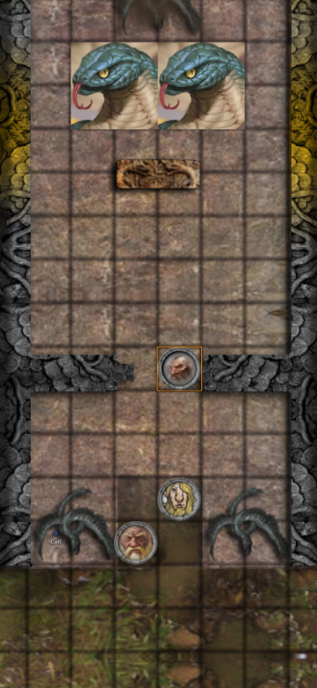
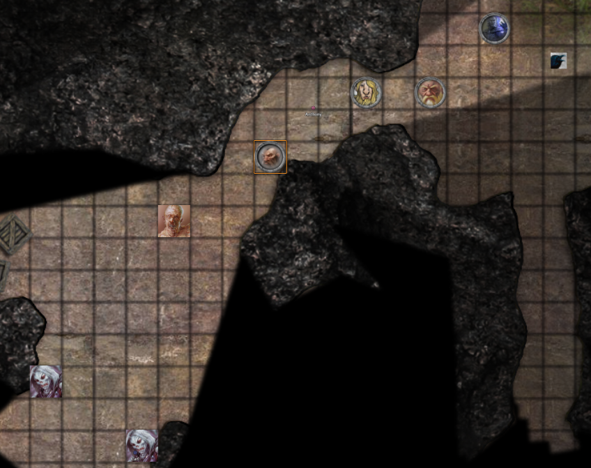
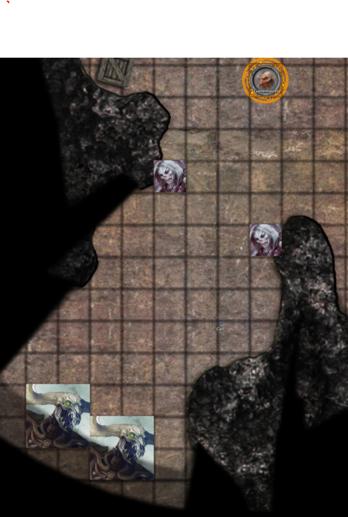

# Session 11

Date of session: **08/12/2021**

- [X] Anthony (**Jasper**)
- [X] Carl (**Alvyn**)
- [X] Martijn (**Svenn**)
- [X] Tom (**Sargon**)

**Disclaimer**: geen spellcheck of grammar check

## Raiding a temple

We staan voor de tempel met de volgende spell nog actief:

- Spirit Guardians (**Sargon**)

We lopen door de stanbeelden door.  
Allemaal van dezelfde *Winged Serpent*.

2 ervan staan gedeeltelijk onder water. 2 staan op het verhoog meer naar de ingang van de tempel.  

Tussen de twee pilaren staat een groot standbeeld van een *Winged Serpent*.

**Jasper** houdt ons tegen.  
Hij ziet in de verte een grote slang staan.  
Is het een *naga*?

> De slang in de verte zijn niet de nagas die we zijn tegen gekomen.  

Zien ze er sterk uit?

 Survival Check: 14 (Jasper)

> Ze zien er iets of wat sterk uit

 Roll for Initiatve

In de fight zit er ook een assassin. (enkel **Jasper** kan hem zien)  
Na het verslaan van de serpents focussen we ons op de assassin.

Onder de mantel ziet de assassin eruit als een *Bullywog*.  
Hij heeft een stuk *Jade* bij van 1ft lang (30 cm).  
Is in de vorm van een staff. (ik neem het mee)

 History Check: 0 ( :( )

**Alvyn** en **Sargon** denken meteen terug aan stukken staf die ze eerder hebben gevonden en meegenomen.

**Sargon** heeft een idee.  
Hij haalt 2 stukken van een *Jade* staff boven.  
Ik geef hem het nieuwe stuk staf.

Hij wil de staff opnieuw combineren.

  Mending

De staff begint te transformeren.  
Hij verandert in een soort van *Staff van Jafar*.  
Het wordt een animated *Jade Serpent*.

Hij begrijpt het precies wel als **Sargon** hem beveelt.  
Hij is zo groot als **Sargon**.  
Hij merkt dat het iets levend is.

**Sargon** beveelt de slang om te knikken.

> De slang gehoorzaamd hem

Hij lijkt niet meer op een staff en is nu een *Jade Serpent*.  

De slang moet volgens **Sargon** zich rond hem verstoppen.  
Hij wandelt mee met ons in de schaduw.  

> PET SNAKE UNLOCKED

## Altar room

### Altar

 Perception Check: 19

Ik veeg over het altar en in een van de gegraveerde slangen van het altaar zie ik in ogen van de slang. Het lijkt wel een knop.  
Ik druk daar meteen op.  

Ik hoor een klik en en hoor dat er een iets opengaat.

In een klein compartiment zit:
- kleine rode kaars

Ik steek de kaars aan op het altar in herrinnering van de gevallen mensen in de dungeon of the mad mage.  

Daaarna zet ik me tegen de muur en schrijf ik in mijn boek.

> Short Rest

**Sargon** heeft met zijn slang zitten spelen. (badum-tss)  
De slang is als **Bruno** gedoopt.  

We besluiten de Hydra te laten voor wat hij is en gaan richting *level 9*.  

## Journey to Level 9

We lopen zonder problemen terug naar de anderet tempel (waar **Yoastal** zit).

Vanaf daar lopen we weer in order.  
We komen een grot binnen.  

We merken dat die opsplitst.  
We kunnen hier doorlopen naar *level 9*.  

**Jasper** ziet iets lopen.  
Zombie? of Ghoul?

Aan de voeten van Jasper is een witte gloed.  
Voor we het goed en wel beseffen is de kamer gevuld met groene mist.  

 Constitution Save: ~9~ / 17

We nemen allebie een beetje poison damage.  
Een val?  
**Jasper** zag een witte gloed en meteen kwam de wolk omhoog.  
Een *Glyph*?

De wolk breidt zich verder uit en vult de grot volledig, we verlaten de cave.  

  Detect Magic

Tegen de tijd dat **Sargon** klaar is, is de rook weer verdwenen.  

We sturen **Tal** naar binnen.  
Die ziet nog een afdruk waar iets geweest is.  

Verder dan het beest staat iets *Ondood*, het vleesding is niet alleen.  

Ik probeer 'niet dreigend' naar voor te stappen.  
Als hij merkt dat ik de kamer inloop, begint hij aggresief te worden en loopt op mij af.  

De wights halen hun crossbows boven en richten die op mij.

 Roll for Initiatve

Tijdens mijn charge zag ik nog creatures staan.

Verderop zie ik nog grotere beesten staan.  
Ze briesen aggresief toen ze me zagen komen.

Ik hoor een stem roepen:

> Maak dat jullie weg zijn als jullie je leven niet moe zijn!

Ik spoor iedereen (op verzoek van **Jasper**) aan om terug te gaan.  

Een gigantische fireball ontploft in de gang recht achter ons.

We zetten het nog altijd op een lopen.  
Na een tijdje lopen lijkt het rustig te worden achter ons.

Waarom zijn we gaan lopen?  
**Svenn**

> maar ik ben een Champion van Mithral Hall, ik wil nie sterven in een gang terwijl ik wegloop.

**Jasper**

> Dit hadden we niet  gehaald, als we sterven dan sterf ik aan je zijde.

**Svenn**

> Ja maar we kunnen toch niet altijd gaan lopen, wat als we **Hallaster** tegenkomen dan gaan we toch ook niet lopen?

**Jasper**

> Dan zullen we beter prepared zijn.

Famous quote van **Jasper** (om **Svenn** op te peppen):

> Today was not the day, honor will befall you.

## Level 9 entrance

In de kamer waar we uitkomen ziet **Sargon** traces of Abjuration magic op de grond. (hetzelfde als de trap van daarstraks)

**End of Session**
