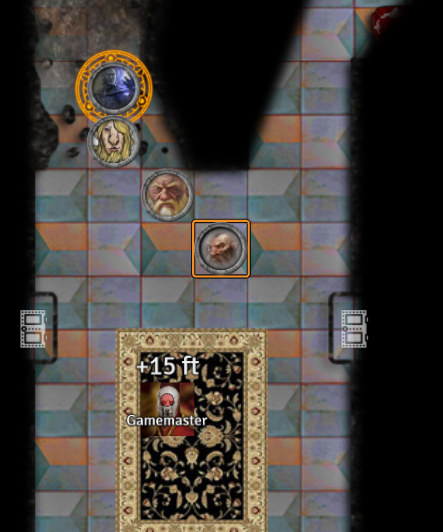
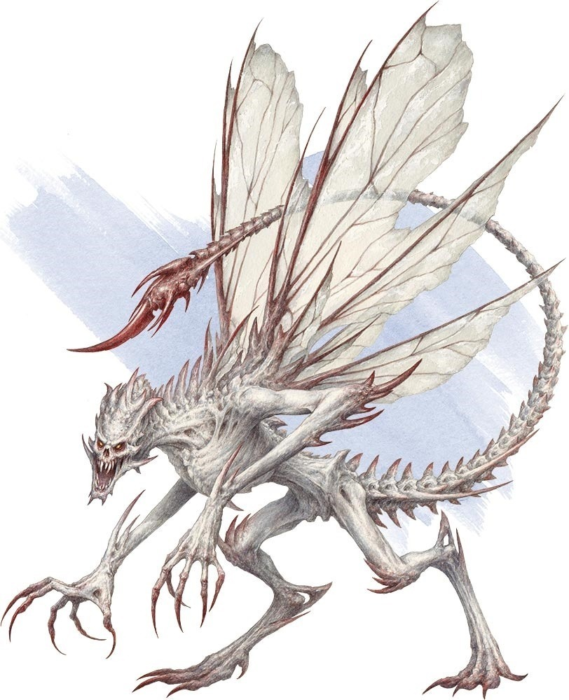
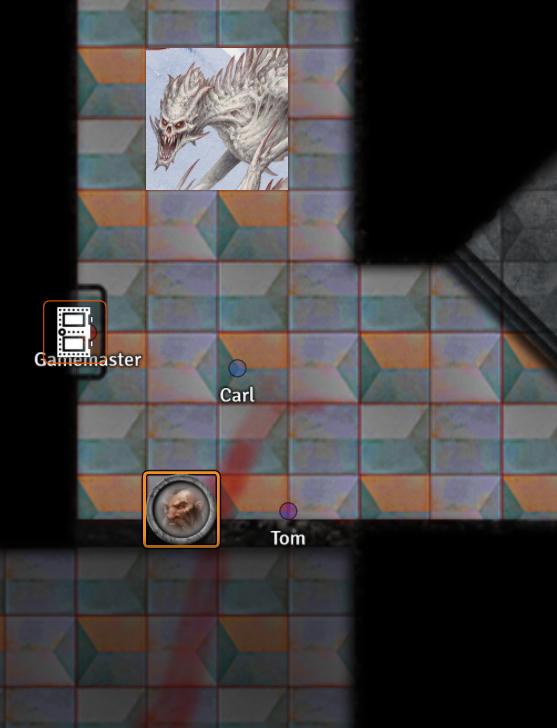

# Session 12

Date of session: **22/12/2021**

- [X] Anthony (**Jasper**)
- [X] Carl (**Alvyn**)
- [X] Martijn (**Svenn**)
- [X] Tom (**Sargon**)

**Disclaimer**: geen spellcheck of grammar check

## Level 9 entrance

In de kamer waar we uitkomen ziet **Sargon** traces of Abjuration magic op de grond. (hetzelfde als de trap van daarstraks)

We dalen af in een tunnel. Richting een kamer.  
De kamer ziet er vrij net uit.  
Een mozaik op het plafond.  
Gebogen arches overspannen de volledige breedte.  
Boven aan het plafond (op 15ft) zien we de overblijfselen van een man.  
Allen nog een linkerhand, een voorarm, zweeft door de ruitmte.

**Abjuration Magic**:

> The School of Abjuration emphasizes magic that blocks, banishes, or protects. Detractors of this school say that its tradition is about denial, negation rather than positive assertion.

We proberen **Tal** eerst te laten gaan.  
**Tal** landt op het vierkant, het vierkant met magie verdwijnt??

We gebruiken Tal voor de andere kamer te ontdekken.  
Een zijkameer is een soort van wachtkamer, met verschillende banken.  

We wandelen de kamer binnen.  

 Roll for Initiatve

Uit een van de zijkameers stapt een mage, die zegt:  
"Oh, bezoekers!"

Hij doet teken naar de hand, de spell die deze aan het casten is, dissipates en verdwijnt.  

De mad mage, **Hallaster** staat voor ons, hij begroet ons.  
We hebben nog eens bezoekers, avonturiers.  
Welkom bij mijn school.  
"Willen jullie vechten of luisteren?"

Jullie hebben al kennis gemaakt met ..., hij heeft precies al een warm welkom gekregen.  
Zitten er mages onder jullie?  

**Alvyn** kijkt naar **Anthony**.  
Ik geloof mijn ogen niet, **Sargon** en ik kijken mekaar vragend aan.

**Alvyn** wil naar hem toestappen en aan zijn baard gaan trekken (intern).  
Hij doet dit ook, **Hallaster** vindt het niet beleefd en doet een stap naar achter.

Wat doen jullie hier?  
We zijn avonturiers.

Ik kan jullie naar het volgende level brengen in ruil voor een magisch item.  
Een alternatief is dat jullie me helpen met een probleem. Een ex-student heeft per ongeluk via necromancy een *Bone Devil* gesummoned. Als jullie hier mee afrekenen breng ik jullie ook naar het volgende leven.  

Een bone devil ziet er zo uit:

Hoezo is hier een school?

Zijn er nog leerlingen?

> Ja een stuk of 7

Wat leren ze dan?

> Verdiepen in de arcane, ontdekken van nieuwe spells, jee kan het zo zot niet bedenken.  

Kunnen we hier ergens tot rust komen voor we de *Bone devil* gaan aanpakken?

> Misschien heb ik wel iets, maar het risico is dat mijn studenten wel nogal nieuwschierig zijn. Als je de nacht spendeert, moet je wel voor ze oppassen.

Heeft een *Bone devil* zwakheden ofzo?

>

Wat als we hem niet kunnen verslaan?

> Dan ziet het er niet goed uit voor jullie.

**Hallaster** geeft een uitleg over hoe we naar de toiletten kunnen gaan en brengt ons naar een kamer. Waar het vooral is voor te drinken. Als we ons willen opfrissen kunnen we ook nog een douche nemen.  

Pas op als we door de gangen lopen en studentene zien lopen kan het gevaarlijk worden.  
Hier lopen veel excentrieke gevallen rond.

Voorbeeld dat iemand graag een necromancer wil worden, meer corpses nog beter, er loopt ook nog een drow rond. En ook de master pupil **Spite** loopt hier ook rond, jong manneke. Niet de beste, maar wat hij kan doet hij goed. Hij kan niet veel spells maar kan ze wel goed uitvoeren.  

Beetje survival of the fitest, het blijft een jungle.

Blijf maar in de kamer, als ge me nodig hebt, laat het alarm maar rinkelen.  
Als je klaar zijt breng ik u naar de

In de gang zien we allemaal afbeeldingen van vechtende magiers die verschillende scholen van magic gebruiken.

**Jasper** krijgt het aanraden om zijn familiar bij zich te houden.
**Jasper** vraag waarom.  
**Hallaster** is geagiteerd omdat het onbeleefd is.

In het midden van de hal staat een mooi groot standbeeld van een *Medusa*.

Hier kunt ge rustig drinken.  
Let niet op de beestjes in de hoek, die zorgen ervoor dat er niemand aan de watervoorraad zit. *Fiends*

Uit een  grote fontein stroomt lopend water uit.  
De fontein is een lachende **Hallaster**.

Deze kamer zal hij voor zorgen dat het rustig is.  
Voor de deur cast hij een alarm spell waarmee we hem kunnen oproepen zodat hij ons naar de *Bone devil* kan leiden.

**Alvyn** stelt vragen aan **Hallaster** ivm de hand van aan de inkom.  

**Alvyn**: Is de hand in het begin een mislukt spell?  
**Hallaster**: Dat is een mage die vroeger problemen veroorzaakte. Hij heeft het duel met me verloren en is nu de bewaker van de ingang.  
**Alvyn**: Hebt ge de rest van hem ook mee terug kunnen nemen?  
**Hallaster**: Het was te veel rotzooi om hete allemaal te animeren.  
**Alvyn**: Hoe lang terug kan je dingen opnieuw terug animeren?  
**Hallaster**: Je bent precies opzoek naar resurrection en true resurrection spells.
**Alvyn**: Bestaan er echt zo een spells?  
**Hallaster**: Kan ik die hier leren?  
**Alvyn**: Ja dat kan, maar dat kost wel heel veel tijd.  
**Hallaster**: Wil je hier dan les volgen?
**Alvyn**: Ik wil graag alles leren over resurrection spells.  
**Hallaster**: Als jullie klaar zijn met de *bone Devil* dan wil ik je wel een examen lateen afleggen?
**Alvyn**: OK dat is goed.
**Hallaster**: Dan mag je misschien enrollen en een examen afleggen.

**Alvyn** zijn ogen stralen en hij is heel enthousiast.

Zijn er limieten hoelang iemand dood kan zijn?  
**Hallaster**: Ze moeten wel willing zijn om terug te komen en niet gestorven aan natural causes.

**Hallaster** legt alle resurrection manieren uit.  
Bij de meeste zaken is er een tijdslimiet, als die vrij kort zijn, kijkt **Alvyn** treurig.  
Een van de spells is neit langer dan een eeuw.  
Dan is **Alvyn** getriggered. Welke spells is dat dan?
**Alvyn** wordt opgewekter en opgewekter, kan ik dat leren??  
**Hallaster** zegt dat het wel moeilijk zal zijn, omdat hij niet als een gewone wizard met magie omgaat.

Het gaat moeilijk worden voor hem om dat te leren.  
Hij kan het proberen.  
Maar resurrection spells zijn maar voor enkele weg gelegd.  

Van wat hij hier ziet (van de avonturiers), is er maar 1 iemand die het kan leren.  
Hij wijst naar **Sargon**.

**Hallaster** kan het niet zomaar aan **Sargon** leren.  
Dit moet hij meekrijgen van zijn deity.  

**Alvyn** vindt het jammer dat er zoveel hordes te nemen zijn eer iemand het kan.  

**Alvyn**

 Insight Check: 16

Hij spreekt precies niet helemaal de waarheid.  
Vooral als **Alvyn** vraagt kunt gij dat casten?

**Alvyn** merkt op dat hij liegt!  
Ik lieg niet, ik weet alleen niet of ik het wil.  

Hoe lang is hij dood?  
**Alvyn**: 20 jaar

Dit gaat me te veel krachten kosten om het uit te voeren en dan ga ik verzwakt achterblijven.  
Mensen willen hier misbruik van maken (hij kijkt naar de **elf/drow/Jasper**).

Hebt ge meer geld nodig?

**Alvyn** wordt agressiever en brutaler.

**Hallaster** zegt dat **Alvyn** moet kalmeren, maar stelt 2 opties voor:
1. Wish spell
2. Wacht tot **Sargon** het leert en u wil verderhelpen

**Alvyn** : Wie kan me hiermee helpen?  
**Hallaster** : Hiervoor moet ik in mijn registers kijken, maar let op dit kan volledig fout lopen!  
Pas op dat het geen monkey paw is.

**Alvyn** vraag aan **Sargon** of hij hem wil helpen.  
**Sargon** zegt dat als hij de spell kent, hij hem wel wil helpen.  
**Alvyn** wordt er emotioneel van, hij valt op zijn knieen en zegt dat hij alles voor **Sargon** zal doen.

We willen een long rest doen.  
Tijdens het slapen, krijg ik een nachtmerrie.  
Ik word achtervolgd door slangen en een gigantisch winged serpent.
Ik kan geen long rest doen.  
Ik heb wel short rest gedaan.

Misschien toch in mijn gedachten blijven hangen en heb ik gewoon een slechte nacht gehad.

's ochtends schrijf ik onze avonturen nog op in mijn boek.

## Onderweg naar de Bone Devil

Na het rusten, beslissen we om de alarm spell te triggeren en naar de *Bone devil* te gaan.

**Alvyn** gaat op de "trap" staan. Hij wandelt op de deur af.  

 Strength Check: 20

Hij doet de deur open, maar is niet gewoon aan het gebruik van zijn *Gauntlets of Ogre Strength* de deur begint te barsten.  

De klap van de deur echoot door de gang.

**Alvyn** triggered de alarm/trap.  

**Hallaster** komt onze kant opgewandeld om ons op te halen.  
Hij begroet ons.  

Klaar om ons van de *Bone Devil* te verlossen?  

**Jasper**: Kunnen we wat meer info krijgen voor we het gevecht aangaan?  
**Hallaster**: Zie het als een uitdaging, soort van toelatingsproef.  

Hij leidt ons naar de *Bone devil*.  

De mage, formerly known as *Yarek* heeft het beest gevangen in een kamer en opgesloten met een glyph waar fiends niet uit kunnen ontsnappen.  

Hij waarschuwt ons, vooral **Jasper** zorgt dat ge volgt en hou u familiar bij!  

Onderweg probeert **Sargon** te vragen waarom **Alvyn** een resurrection nodig heeft.  
**Alvyn** ontwijkt de vraag, **Sargon** weet dat hij moet stoppen.  

### Encounter met een student

Na een tijdje lopen komen we in een grote kamer met een 10ft hoge plafond.  
Verderop in de kamer loopt een vrouw rond, met daarachter een grote shield guardian.  
Er lopen nog andere mensen rond, vrouwen, een grel, ...  
De vrouw antwoord dat ze klaar is met de les.  
Ze lopen ons voorbij de gang in.  

### Klaslokaal

Daarna lopen we door een leeg klaslokaal.  
Het is er zeer stil in de ruimte.  
Zelfs voetstappen worden stil gehouden.  
Nette rijen bureaus staan richting een bord waar een lector kan staan.  
Achteraan zijn een aantal buizen die de plafond in gaan.  
Er staan kleine opschriften op, maar die zijn te ver om te lezen.  
Het lijkt op het postsysteem van de keuring. :D

### Cellen

Daarna lopen we door een smalle gang met allemaal cellen.  
In het begin zit een goblin.  
Op het einde van de gang een standbeeld van een versteende *Dragonborn Wizard*.  
Op het plakaat eronder staat: "Volg de regel, gehoorzaam aan de instructies, wees niet deze kerel"  
Les voor de rest van de studenten

Voor we de kamer binnengaan, messaged **Jasper** me.
Dat hij het een slecht idee vind en het niet zeker is of hij ons allebei kan redden.  

**Hallaster** ziet dit gebeuren en hij cast ook iets.  

Meteen erna hoort **Jasper** in zijn hoofd:
Je kan me wel of niet geloven dat ik **Hallaster** ben, maar mijn kracht moet ge niet onderschatten.

**Hallaster** zegt good luck en dat we maar moeten roepen als we klaar zijn.  
Hij kijkt naar **Alvyn** als je het niet overleeft, moet ge zelfs geen examen proberen.  
Als ge er in slaagt, stel ik voor dat ge de *drow* achterlaat, ik heb er hier al ene rondlopen en moet er niet nog ene hebben.  

## To hunt a Bone Devil

We wandelen de kamer binnen, er ligt een lichaam van een doe mage. Een bloedspoor leid naar een noordermuur waar het verwijnt.
Aan de westermuur hangt een gigantisch bebloed tapijt met afbeeldingen van vechtende duivels en demonen in zwaar gevecht.

Ik wandel naar het lijk en wil kijken hoe toegetakeld hij is.  

 Medicine Check: 18

Ik zie dat hij op zijn buik ligt.  
Ik merk dat hij meermaals in zijn buik is geraakt door een puntvormig wapen en er loopt iets groen uit.  

Ik wandel naar de muur waar het bloedspoor vandaan komt.  
Ik voel eraan, het is geen solide muur.  
Als iedereen klaar is, stap ik door de muur en sta oog in oog met een *Bone devil*.

Verder in de kamer staat er een standbeeld van een *drow*/elf die op een hagedis aan het rijden is. (vervallen)

 Roll for Initiatve

In een zijkamer vinden we een protaal.  
Gravering van een open boek.  
Met enige tegenzin doe ik de boek open voor de portaal, maar er gebeurt niks.  

## Reporting back

Het probleem is afgehandeld.  
**Hallaster** gaat controleren.  
Hij is tevreden met ons werk en gaat ons begeleiden naar het volgende leven.  

Als we goed kijken zien we op de deuren glyphs staan waardoor fiends de ruimte niet uitkunnen.  
Magie kan gevaarlijk zijn en moet met respect behandeld worden.  
Dit is een van de gevolgen van een onvoorzichtige student.

Door de portal room duwt hij een paneel open een lange gang in.  
Hier duwt hij opnieuw tegen een paneel dat opengaat.  

Hierachter is een trap, zoals beloofd de doorgang naar het volgende level.  

Bedankt van allebei de kanten.  

Hij zegt dat **Alvyn** zich nog kan inschrijven en de school weet moest hij nog interesse hebben.  

Succes op de zoektocht.  
Zie wel dat je niet zomaar terug komt onuitgenodigd, want dan hebben

**End of Session**
