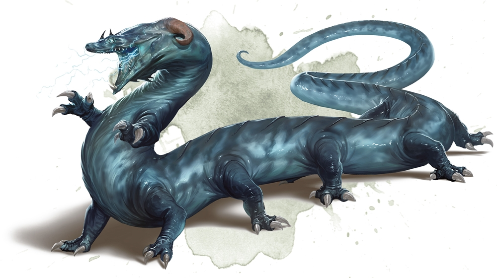

# Session 20

Date of session: **12/09/2022**

- [X] Anthony (**Jasper**)
- [X] Tom (**Sargon**)
- [X] Brecht (**Halkin**)
- [X] Martijn (**Svenn**)

**Disclaimer**: geen spellcheck of grammar check

## Korte rust voor we weer verder gaan

We nemen een short rest, ik schrijf ondertussen in mijn dagboek.  
Ondertussen probeer ik er achter te komen wat **Zaztorrl** nog wil doen.  
Of we hem moeten bevrijden

> Als we willen, zal hij ons naar het volgende niveau begeleiden zodat we er geraken.  
Hij kan ook een audientie regelen.

Met wie dan?  

> Met Erelal

Zijt ge hier ontsnapt?

> Hij wijst naar gebied op level 12, 18-19.
Ik ben niet ontsnapt, eerder gedeserteert. Ik was niet meer akkoord met de leider.

Wat voor weg waren ze aan het bewandelen?

> Tgoh, bepaalde keuzes waar ik het niet mee eens was.  
Ik wou geen invasies meer, we maken enkel nog oorlog met de andere drow.  
Volgens mij is dat helemaal niet nodig.

10 - 12 - down?

> Hier zijn ook we lforces van house **Auvryndar** , als we die kruisen of andere van Freth ze kruisen kan het wel oorlog zijn.  
Als ik met die van Freth kan praten kan ik wel ove

11-13 down?

> Moeilijker, spinnenwebben etc.  Er zitten geen spinnen maar wel moeilijker om te navigeren.
11 weet ik niet meteen wat er is, misschien nog wel dingen, maar vooral als opslag.  
Kan zijn dat er af en toe iemand komt, maar geen patrouilles.

## Avoiding patrols on the way to the troglodyte treasure

De troglodytes hadden gezegd dat er onderaan in het bos van bomen (17?) schat te vinden is.  
Daar gaan we op af.

We wandelen eerst richting 10b.  
We horen af en toe zowat echo van water dag drupt.  
Af en toe horen we gefladder uit de put komen.  

We zitten een 100ft van 10b.  
**Jasper** ziet een groot beest gehurkt over een lichaam (*drow*?).  

Hij wijst en stopt ons allemaal dat een groot beest, zowat verminkt/vervormd figuur (donkergroen) gehurkt staan.  

 Perception Check: 18

**Jasper** ziet lang donkergroen zwart haar gehurkt een lichaam aan het opeten is.  
Het is niet gehurkt, eerder gebochelt.  
**Jasper** ziet de beenderen en een costuum van de *drow* liggen.  
**Jasper** roept **Zaztorrl** dichterbij en vraag of ze last hebben van "ongedierte"?

> Bedoel je de troglodytes?

Nee, die bedoel ik niet, dingen die *drow* opeten.  

> Soms hebben we wel wat last van een troll.

Hoe ziet die eruit?

> Groot groen monster, met grote tanden, grote klauwen, ...

Zoals dat daar?

> Zou wel eens kunnen.

**Jasper** beschrijft het aan ons.  
Het lijkt erop dat hij alleen.  

We besluiten het aan te vallen.  

**Jasper** waarschuwt **Zaztorrl** en vuurt zijn *eldritch blasts* af.  

 Roll for Initiatve

Na het raken met een blast, ploft er een van zijn builen en er vliegt vanalles uit.  
🤮🤢

Wanneer **Halkin** dichterbij komt, ziet hij dat het zwarte lange vliegen zijn.  
Hij hoort een overdovende *bzzzt*

**Halkin** wordt helemaal omsingelt door de zwermen en ze proberen hem te steken.  
De cloak van hem kan hem niet beschermen. Ze beginnen hem te bijten.  
Hij neemt scade.  

We verslaan de *troll* en zijn zwermen muggen.  
**Jasper** ziet demonen vechten en we horen het gekletter van zwaarden.  

We beslissen om via 13 te gaan.  

## To the treasure room

We gaan naar kamer 13.  
Als we dichterbij komen, ebt het gekletter weg, in de grote opening richting 12 zien we grote groepen van *drow* vechten met mekaar.

*drow* vs *drow*.  

**Jasper** vraag wie zijn kant is.

> Dat is **Spireth**, de mage waar ik vroeg mee vocht en degenen die aan het noorden zitten zijn van *Freth*, de zuidelijkere zijn Auvryndar

**Sargon** stelt (in het dwarvish) voor om langs de zijlijn mee te vechten.  
Als we een snelle scan doen, zien we vooraan **Spireth**, daarachter nog een stuk of 9 andere *drow*.  
Aan de andere zijde zien we 15 *drow* staan, met daarachter een priestess.  

**Zaztorrl** kent niet zoveel volk van de andere kant, ook niet de priestess.  

We besluiten het gevecht te negeren.  

Als we bij 13 aankomen zien we een hele hoop stalagmieten en stalagtieten.  
Een groot gordijn van spinnenwebben maakt het difficult terrain om door te lopen.  

**Sargon** steekt een torch aan en brandt de webben weg.  
Dat is vrij effectief.  

**Zaztorrl** wijst richting de storage (een kleine alcove in de noordzijde van de grot).

Loot:
- 20 rations (gedroogd vlees)
- Satchel gemaakt van lizard skin
- Fles van een soort vloeistof (mushroom wine)
- Kleien pot, vanboven afgesloten

**Zaztorrl** herkent de vloeistof als de gekende mushroom wijn.  
**Sargon** opent de kleien pot, vanbinnen zit een vloeistof.  
**Zaztorrl** zegt om ermee op te passen, want het is *drow* poison.  

**Halkin** neemt de pot mee.  

Voor de rest niet zo veel in 13.  
Wegbranden van de webben helpt om er sneller door te gaan.  

## On to the treasure

Het gevecht in 12 is aan het doorgaan.  
Vanalles is aan het doorgaan.  

We gaan het hoekje om richting 17.  

We lopen door een smalle gang.  
We komen op een smalle gang.  

We gaan richting 17a (rechts).  
Daar liggen verschillende botten op de grond.  
De ingang naar 17a en verdop zien we de rotsformaties scherper worden.  
Het lijkt alsof we een mond binnenwandelen.  

**Jasper** vraagt aan **Zaztorrl** wat hier zit.  
Hij weet het niet.  

Hoe dichter we bij de open mond gaan, ziet iedereen af een toe een blauw-witte flits.  
De wouten??  

**Jasper** probeert het te herkennen.  

We gaan de grot verder in naar 17c.  

We horen gekraak van de botten die onder ons breken.  
We benaderen de grot, we zien een hele hoop stalagmieten de grot bedekken.  
De grot is ongeveer 50ft hoog.  
Tussen de stalgmieten zien we een vrij gespierd lichaam bewegen.  
Een beest met 12 poten wikkelt zich tussen de stalagmieten.  
Het is een blauw gespierd lichaam.  
Een *behir* zit in de grot.  

 Roll for Initiatve

Tijdens het gevecht teleport de *behir* weg.  
Daarna komt er bliksem uit zijn mond, hij cast *lightning breath*.  

Na veel damage te doen, gaat de *behir* invisible en kruipt tegen de muur.  
Hij kan niet gaan lopen van mij door *champions call* dus hij moet binnen de 30ft zitten.  

Na enige tijd krijgen we hem tevoorschijn en kan **Svenn** de finish blow toedienen met een magnificent handaxe throw en het beest sterft!  
**Sargon** probeert zijn hoofd eraf te hakken, maar faalt miserable en plet heel zijn hoofd.  

We wandelen door de caves op zoek naar treasure.

Op een verhoog ligt een kleinere grot, het plafond naar het verhoogd is versierd met verschillende gems.  
We klimmen op de berg van botten. Achterin ligt zijn hoard.

Loot?
- 13400 gp ==> 3350 per persoon
- 8200 sp ==> 2050 per persoon
- Broach van een schorpioen van goud en onyx (p 158 17d) -> **Svenn** steekt die op zijn harnas
- Zilveren kistje in een gevlochten stijl (p 158 17d) -> **Sargon**, in het kistje begint er vanalles te klikken, gelukkig komt er muziek uit.
- Helm (full face helmet), metaal (p 158 17d) -> **Svenn**

Short rest terwijl **Sargon** detect magic doet.  
De helm bevat illusion magic.

**End of Session**
