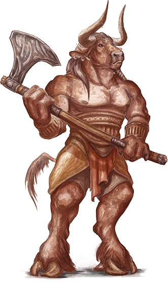

# Session 21

Date of session: **26/09/2022**

- [ ] Anthony (**Jasper**)
- [X] Tom (**Sargon**)
- [X] Brecht (**Halkin**)
- [X] Martijn (**Svenn**)

**Disclaimer**: geen spellcheck of grammar check

## Standing around in the lair of a Behir

But FIRST, a long rest.

 Perception Check: 15

Terwijl we aan het rusten zijn, horen we echo's in de gang.  
Het klinkt een beetje als een kat.  
**Halkin** gaat op verkenning.  
Beschermd door mijn *Warding Bond*.

**Halkin** gaat stealth bomber style.  

 Stealth Check: 32 🤯

Hij begeeft zich naar het geluid.  
Het lichaam van de *behir* ligt daar, tussen de poten van de *behir* ziet hij:

 Perception Check: 15

Een kleine *behir* zitten.  
Ongeveer een 5-6 ft.

  
Halkin vs the mini behir

  
Hij wandelt op de mini behir af met een beetje rations. Hij probeert het kleine beest te lokken.

  
Vanaf hij achter de stalagmiet uitkomt, ziet hij de behir naar achter schuifelen tegen zijn "ouder" en begint te hissen.

  
Animal handling: 17

  
Hij weet de mini behir te kalmeren (zie Chris Pratt in Jurassic World met Blue)

  
Hij komt rustig naar hem toe.

  
Dex Save: 13 

  
De behir hapt naar het vlees. Hij was niet op tijd om op tijd het vlees los te laten. 

  
Zijn hand wordt serieus verkeerd gebeten. Recht in zijn pees.

  
Zie na de spoiler voor het intermezzo

  
Het beest is wel een beetje gekalmeerd zo lijkt het. 

Intermezzo:
Ik schrik wakker, want ik neem ineens 11 damage.  
Ik voel een scherpe pijn in mijn pols.  
Als ik wakker wordt, ga ik op de rand van die afgrond te staan om te kijken wat er aan de hand is.  
Door de stalagmieten en de verte kan ik niet zien wat er aan de hand is.  
Ik spring van de cliff af met mijn schild (als soort van slee).  

 Acrobatics Check: 19

Het lukt, na een serieuze knal later sta ik onder aan de cliff.  

**Sargon** schrikt er van wakker, hij komt ook kijken wat er gebeurd is.  
Hij ziet een cliff van 9 meter waar een spoor tussen de botten is getrokken door mijn slee actie.  

Hij beslist toch om gewoon te gaan wandelen via het pad ipv de cliff.

Ik zie ondertussen dat **Halkin** tegenover een *behir*.  
De *behir* is wild aan het eten van het vlees en **Halkin** staat ervoor naar zijn arm te grijpen.  

Terwijl ik met getrokken wapens luid richting de *behir* stap om hem aan te vallen zie ik dat die terugdeinst en fel begint te doen.  
**Halkin** stapt erop af?  

Ik wandel voorbij **Halkin** om hem te beschermen en het beest te verslaan.  
De *behir* doet zijn *dragon's breath* op mij.  

Ik neem 29 lightning damage.

 Roll for Initiatve

**Zaztorrl** en **Jasper** doen niet mee, ze liggen te spoonen op de cliff.  

**Sargon** weet met zijn warhammer het hoofd van de mini *behir* af te hakken.  
Hij neemt het mee als trophy.  

Terug naar boven.  
We proberen een long rest te doen.  
Ik vul ondertussen het dagboek bij.  

Poging #2 om een long rest te doen.  
Af en toe horen we een geluidje maar niks schrikwekkend.  

Identifying the helmet, ik kwam in de buurt, maar ik weet nog niet wat het voor een helm is.  

**Sargon** ziet me sukkelen en beslist om me te helpen.  

  Identify

Hij komt erachter dat de helm een [dread helm](https://www.dndbeyond.com/magic-items/27045-dread-helm).  
**Sargon** vertelt me niet wat het ding doet, enkel dat ik de volgende keer "hey loser" naar een *drow* moet gooien.  
Hij wil dat ik het vooral roep naar vijandige *drow*.  
Uiteindelijk biecht hij op dat het niks doet. Enkel mijn ogen gloeien.  
We beslissen dat ik de helm op kan houden tot we hem kunnen verkopen.

## Moving on to the next level

**Zaztorrl** verteld dat het volgende level eigenlijk een doolhof is.  
Hij kan ons er op een veilige manier doorleiden zodat we bij **Erelal** aankomen.  

Hijzelf gaat niet mee naar binnen, want hij wil ontsnappen.  
Hij heeft niet genoeg te zeggen om ons er veilig binnen te brengen.  

> Zitten er nog *drow* in die settlement?

**Zaztorrl** geeft aan dat het nog een heel actieve settlemetn is van house **Freth**

> Veilige doorgang?

Nee, langs:
- 10 is de korste weg, maar chockepoints die gevaarlijk kunnen zijn. (*Incubi* en *Drow* liggen op de loer)
- 7 is de weg langs (een heel deel) *minotaurs*

Na een hele lange discussie met veel input van **Zaztorrl** beslissen we langs 7, de *minotaurs* te gaan om misschien met een portal van 8b naar 12a te teleporteren.  

## Level 12 - Maze Level

We komen uit op level 12. **Zaztorrl** gaat ons begeleiden, dus we lopen met hem mee.  
Hij loopt op kop tot het begin van de *minotaurs*.  

Vanaf dat we in de grot komen, valt het op dat de vloer bedekt is met een lichte mist.  
Ongeveer 2ft hoog, we kunnen de grond niet zien.  

Hij zegt dat de vloer soms wat oneven is, maar probeer vooral in dit deel te volgen.  
Er hangt een vrij vieze geur van dood.  

Van waar komt de mist?

> Dat weet hij niet meteen, in het algemeen hangt die praktisch overal.  
Dingen kunnen verstopt worden. Ik heb beloofd jullie te leiden dus ik ga die houden als jullie me laten leven.  

 Insight Check: 7

**Sargon** gelooft hem wel.  

### 1a

We zien een aantal verroeste hoofden uit de mist steken.  
Ale ja verroeste helmen.  

### 2a

Vanaf dat we daar binnenwandelen horen we in het Elvish:"Volg mij!"  
**Zaztorrl** zegt dat we het moeten negeren, volg mij maar gewoon.  

Ik wil er wel verder op ingaan, is dat een val van jullie?

> Je blijft het gewoon nog wat vaker horen.  

Terwijl we wandelen blijven we dat in de verte horen.  

### 5

Terwijl we richting de *minotaurs* wandelen, horen we nog steeds de stem.  
Als we er bijna zijn zien we een grote open grot met 3 pilaren (stalagmieten) waar het lijkt alsof de mist nog dikker is.  
Hier gaan we niet helemaal in de kamer.  

Hij zegt:

> Vanaf hier kunnen de *minotaurs* komen, dus kunnen jullie de leiding overnemen?

### 7 - Minotaur territory

Achter een van de stalagmieten zien we een paar *minotaurs* staan.  
Vanaf dat ze ons zien, chargen ze op ons af.  

 Roll for Initiatve

Van achter de hoek komt nog een *minotaur* aan gerushed en staat neus aan neus.  

**Zaztorrl** hp tracker:
 - 71 -> 50 -> 43 -> 17

De groep tegen 12 *minotaurs*.  
We are victorious!

Loot en verkennen is voor de volgende sessie. We staan in 7a.

**End of Session**
