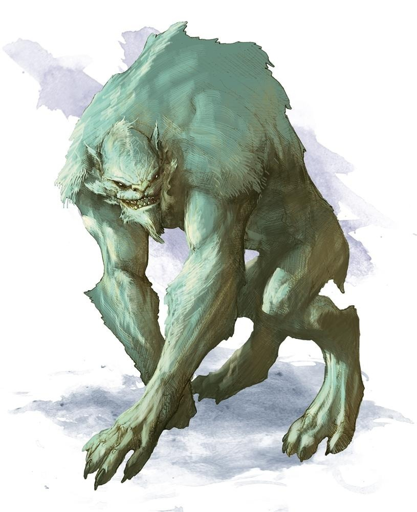
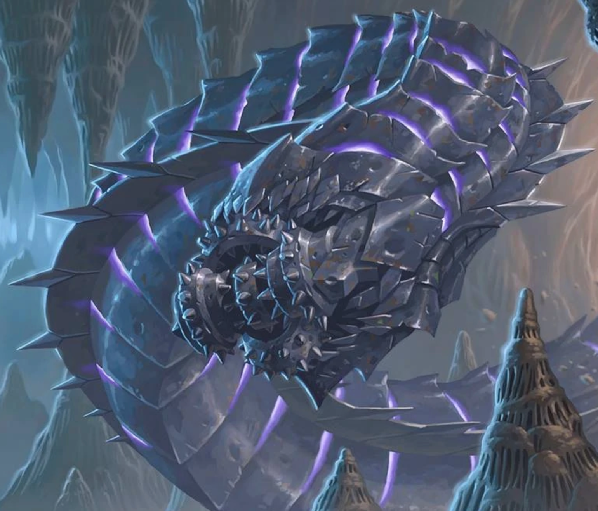

# Session 26

Date of session: **05/12/2022**

- [X] Anthony (**Jasper**)
- [X] Tom (**Sargon**)
- [X] Brecht (**Halkin**)
- [X] Martijn (**Svenn**)

**Disclaimer**: geen spellcheck of grammar check

## Combat where we left off

 Roll for Initiatve

Damage Meter (Svenn) (individueel niet opgeteld) continued:   
  22 ->  
Heal Meter (Svenn) (individueel niet opgeteld):   
  9 (Mass healing word // Sargon)  

Na een paar ronde combat (en met dank aan sunbeam), kunnen we de *drow* uitmoorden.  
Na de *drow* uit te moorden is er een mage gaan lopen.  

We zetten de achtervolging in.  
We lopen door 12b.  

Vanuit 12b ziet hij de mage niet lopen op de vlakte voor de toren in 18a.  
Hij ziet niets op het veld naar 18a en ook niet op de toren van 18a.  

De andere torens zijn net te ver weg.  

12c is moeilijk zichtbaar door de metalen webben die er getrokken zijn.  

In 12b zien ze een metalen spin staan (heeft die de draden geweven?)  
**Sargon** laat zijn *Minotaurs* de spin kapot maken.  

Terwijl de *Minotaurs* bezig zijn, horen we in de verte een horn blazen.  

Over de muren van de burcht ziet **Jasper** allemaal *drow* (stuk of 8) lopen met bogen.  
Mix van mannen en vrouwen.  
Ze hebben hun bogen klaar voor te vuren.  

We verkennen 12c.  
Hier is niet zo gek veel te zien.  
Vooral van die stalen webben die we door de kamer geweven zien.  

 Perception Check: ~4~ 17 (Sargon)

Het is moeilijk te zien maar het lijkt alsof **Sargon** iets over de kabels ziet lopen.    
De *Minotaurs* worden dieper de kamer ingestuurd en proberen de kabels stuk te maken.  

Het kost wat moeite maar het lukt om de kabels af te breken.  
Een deel van de kabels (na 2-3min) zijn gebroken en een goeie doorgang tussen 12b en 12c is nu zichtbaar.  

Het lijkt alsof er nog vanalles aan het "luren" is, maar er gebeurt nog niks.  
**Sargon** stuurt 1 *Minotaur* als offer midden in de kamer (12c).  
Vanaf hij er geraakt, zien we opeens een paar stevige blauw-witte wezens naar beneden springen en de *minotaur* aanvallen.  

We gaan de poort in 12a inspecteren voor we doorgaan.  
Op de stenen vanboven staat een bekend beeld (gravering van 2 skeletal minotaurs aan elke kant).  
Dit hebben we nog nooit erder gezien.  

### Portal / Gate Discovered (Level 12 -> Level 14) --> Minotaur Gate

1 van de *minotaurs* raakt de poort aan -> Gebeurt niks
ledemaat van de *minotaurs* ertegen aan -> Gebeurt niks

Loot:
*Drow Captain*:
  - Mooi isigna (onyx in de vorm van een scarab) (p )
  - Gewoven zakje: 2 stenen (peridots)

 History Check: 6 (Jasper)

De insignia zegt **Jasper** niks.  

*minotaur* met insignia richting de poort -> Gebeurt niks
**Sargon** neemt de insignia terug.

We gaan richting 13 / level 13.

## Onwards to the next Level

Het geronkel wat we zachtjes hoorde, lijkt dichterbij te komen.  
In een grote tunnel (radius 20ft.) komen we nu uit.  

Een stukje verderop zien we het einde van de gang.  
Het geronkel wordt luider en luider.  

## In a tunnel

Op een 20ft. van ons zien we een opening waar de tunnel onderbreekt.  
Daarachter zien we de tunnel naar beneden gaan.  

 Perception Check: 16

Aan de rand van de tunnel zien we dat door de trillingen steentjes van de tunnel vallen.  

Ik beslis om de cliff op te klimmen.

  Athletics Check: 21

Ik slaag er in om (met behulp van mijn handaxes) de cliff op te klimmen en gooi een touw naar beneden.  

**Halkin**, die als laatste omhoog klimt, ziet nog net voor hij het haalt een gigantische construct (metalen worm met scherpe tanden) om de hoek komen.  

De *minotaurs* proberen nog naar boven te klimmen.  
We zien ze klimmen, maar de worm heeft ze gespot en lijkt hen te gaan aanvallen.  

 Roll for Initiatve

100 ft lang 15 ft diameter

**Sargon** en de *minotaurs* slagen er (wonder boven wonder) erin om het hoofd van de bore worm er vrij schoon af te krijgen.  

**End of Session**
