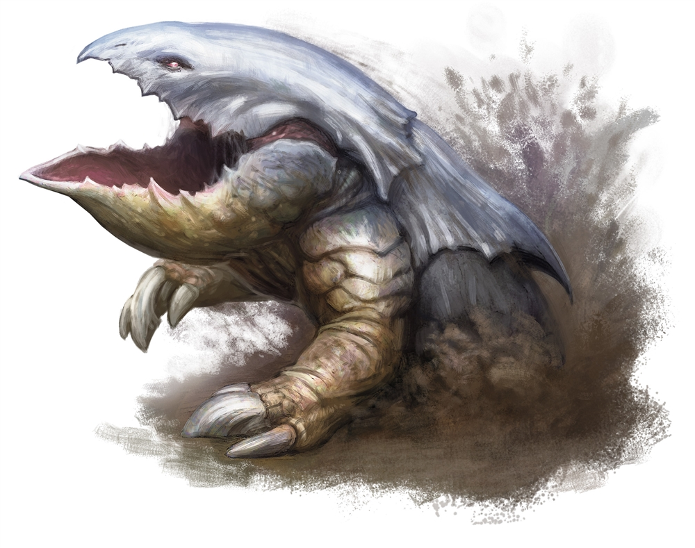
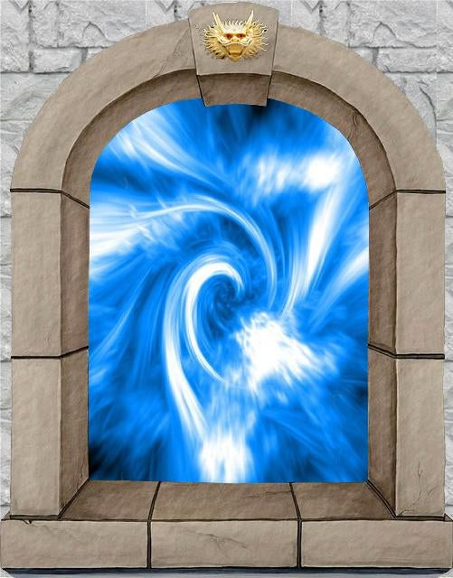

# Session 3

Date of session: **28/04/2021**

- [X] Anthony (**Jasper**)
- [X] Carl (**Alvyn**)
- [X] Martijn (**Svenn**)
- [X] Tom (**Sargon**)
- [ ] ~~Sofie (**Faye**)~~

**Disclaimer**: geen spellcheck of grammar check

## A body at our feet

We staan in een kamer met een zwarte sarcophaag.
Daarop staat een dwerg gegraveerd.

 History Check: 1 & 1

Ik weet niet van welke clan deze graftombe is.

De kamer aan het einde van de gang gaat weer stilaan omhoog. (we weten hoe we ze weer kunnen openen)

"Hebben jullie alle maps?"
Sargon - "We hadden bestelling lopen voor de rest van de maps."

Sargon haalt een papiertje uit Faye haar loot en zegt dat hij een bewijs heeft om ze te gaan ophalen.

## Back to Willowwood

Sargon maakt aanstalten haar te begraven in het bos.
Ik waarschuw hem om het bos niet te storen.

We gaan naar **Willow**.

Willow komt uit haar boom, ze kijkt hen teleurgesteld aan.
"Wat brengt jullie weer hier in het bos, ik heb vernomen wat er is gebeurd met jullie en durelai(?)"
"Jullie kunnen passeren maar zijn niet meer echt welkom in het bos." - Willow

"Waarom niet?" - Alvin

"Jullie hebben het bos in groot gevaar gebracht, jullie kennen toch **Tearulai**? De draak waar jullie vrienden, **Daelar** en **Theoren** zijn gesneuveld. Hij is een bedreiging voor het bos. **Valdemar** (voorganger van **Tearulai**) hebben **Valdemar** proberen vermoorden, het magische zwaard **Tearulai** heeft de draak overgenomen en is niet meer de kwade draak. Nu leven we in vrede samen." - Willow

"Mijn voormalige groepsgenoten hadden een héél, héél héél dom plan. Ik zou enkel het lichaam van **Daelar** willen meenemen om hen ergens te begraven voor een passend afscheid te nemen."

"De gevallen broeders (**Daelar** en **Theoren**) zijn al begraven bij **Krissam** (een gevallen vriend)" - Willow

Ze leidt de groep naar het graf van **Krissam**

## Funeral

**Willow** neemt ons mee naar een graf diep in het bos.
Er is een vrij groot vuurvliegje dat rond blijft dwalen.

  
Alvyn

  
Herkent dat het een Will-o-Wisp is.

  
Undead/spirit

Naast het graf liggen twee hoopjes los zand (waar **Daelar** en **Theoren** al begraven liggen) hier kunnen we nog een graf maken voor **Faye**.

**Sargon** spoort **Alvyn** aan en zegt dat hij ook nog iets moet zeggen.
Hij schuifelt naar voor, met de tranen in zijn ogen:
"Ik kan niet terugdraaien wat er met mijn vrienden gebeurt is, hoe pijn het ook doet. Ik zou er alles voor geven zodat deze feiten teruggedraaid kunnen worden. Maar dat kan ik niet. Als je het in je hart kunt vinden om me te vergeven, zou het me rust kunnen geven. Ik weet dat het niet genoeg is, maar voor alle leed die ik u en uw bos heb bezorgd, mijn grootste sorry."

"Het is niet enkel aan mij om vergiffenis te vragen. **Tearulai** zou je best ook om vergiffenis vragen."

Alvyn vraagt aan Willow of de draak echt zo onmenselijk slecht was dat ze er OK mee is dat de draak nu verandert is.

Voor Willow bestaat Valdemar niet meer.

**Sargon** begint een graf te maken voor **Faye**.
**Alvyn** probeert, tevergeefs om hem te helpen.

Na ongeveer een half-uur graven is het graf klaar.
**Faye** wordt in het graf gelegd.

Willow haalt een wand boven, ze zegt een spreuk en het graf wordt bedekt met bloemen. (net zoals de andere graven)

**Sargon** gaat naar het graf van **Daelar**

"We hebben zoveel meegemaakt, er zullen geen verder avonturen meer komen, ik hoop dat ge kunt vinden wat ge wou vinden."
Sargon zet een beker gevuld met goed bier op het graf neer.

**Sargon** gaat naar het graf van **Theoren**

"Theoren, ik heb je neit lang gekend en niet helemaal vertrouwd. Hopelijk vind je rust waar je zou mogen zijn."

We bedanken **Willow** en gaan richting **Skullport** om de bestelling af te halen.

Vergeet niet je te verontschuldigen tegen **Tearulai**! - **Willow**

Hij is voor reden vatbaar, maar zijn vertrouwen ga je niet meer kunnen winnen.

We nemen afscheid en wandelen richting de opening naar **Tearulai**. We zijn alleen wanneer **Alvyn** zegt dat het een dom idee is.

Het zwaard proberen halen was ook geen goed idee.

Daar kan ik niks meer aan doen. Waarom moeten we ons excuseren tegenover een zwaard!

Dat zwaard ligt aan de oorzaak dat onze vrienden dood zijn!

**Sargon** beschuldigd **Alvyn** van hun dood!
**Alvyn** blijft erbij dat hij ze niet vermoord heeft, dat was het zwaard.
Wat bereiken we met ons excuseren voor een zwaard!
Dat gaat hen geen rust geven!

**Sargon** vreest dat de draak het gebeid bewaakt en ons zou kunnen aanvallen. We kunnen eerder goed bij hem staan.

**Jasper** en **Svenn** kunnen hen niet sturen. We steunen hen enkel.
Als het **Willow** haar wens is, zou **Svenn** die respecteren, ongeacht het jullie zal helpen of niet.

## Excuses voor Tearulai

We benaderen de trap richting de draak.
**Alvyn** blijft achter **Sargon** terwijl ze de trap opgaan.
**Sargon** probeert **Alvyn** vooruit te duwen.

  
Alvyn en Sargon

  
Tearulai vraagt waarom ze daar zijn. Komen jullie de klus verder afmaken??

  
Sargon zegt dat de groepsgenoten een heel dom plan hadden het met hun leven hebben bekocht. Mijn diepste verontschuldigingen. Hopelijk kan je ons vergeven en hem vergiffenis kan schenken, zodat ook onze companen rust kunnen vinden. 

  
In een veel diepere stem stem horen ze: "Maak het af, trek het zwaard uit mijn hoofd!" In een normale stem zegt hij: "Door de actie van jullie "vrienden" hebben me pijn gedaan, maar hebben ook aan mijn schat bijgedragen. Prettig was het trekken aan mij niet, maar ik zal het toelaten dat ze rust vinden."

  
Weet ge dat er een andere persoonlijkheid ook spreekt?

  
Dat ligt aan jullie vrienden, door aan mij te trekken is de band verslechterd. De diepere stem "Ja dat klopt, de vrienden hebben me weer macht over mijn lichaam gegeven. Bevrijd me van het zwaard en ik beloon jullie rijkelijk!" Hij verandert weer.

**Jasper** en **Svenn** horen de twee stemmen, maar zien niet wat er gebeurd.

## Back to Skullport

De bestlling kan opgehaald worden, maar waar is dat vrouwtje?
We zwijgen en schudden onze hoofden.

Na het ophalen van de mappen zijn we gaan rusten in een lokale inn:  
*Long Rest*

## Continue on in the dungeon

We keren terug naar de kamer waar we begonnen zijn, bij de sarcophaag.  

We weten dat er een knop in de put zin om een geheime deur open te doen.  

Ik open de put en de raaf van **Jasper** kan de put invliegen en de knop bedienen.  
We horen een klik en we zien de deur weer openschuiven.  

De raaf laten we in de put.  
We springen over de put en gaan door de geopende deur.

## A hidden room

We zien een groot tapijt tegen de muur hangen.
In de hoeken zien we verschillende standbeelden staan van imposant uitziende dwarfs.

Tapijt:  
Een koning, met een adamantine warpick in zijn hand is aan het vechten tegen een purple worm.

Standbeelden:
Sargon herkent de standbeelden:
1. Muradin de God van Creatie
2. Baronar Truesilver (hearth and home)
3. Clangeddin Silverbeard (god of battle)
4. Marthammor Duin (nature/trickery)

Bij het zien van Clangeddin, kniel ik en begin ik te bidden.
**Jasper** zet zicht naast me.

Ik klop op mijn schild (met het symbool van Clangeddin) en vervoeg me weer bij de rest.

  
Alvyn

  
Hoort in zijn hoofd: "Ik weet het ware graf van Melair, als je me bevrijd laat zal ik je het geheim laten zien"

**Alvyn** begint aan de warhammer van het standbeeld te trekken.
**Sargon** wil hem tegen houden.

Ge gaat hier toch geen standbeelden vernielen, dat is heidenschennis!

Ge gaat toch geen standbeelden van goden vernielen.
Straks gaat ge ons vervloeken!

**Alyn** wil weten waar **Melair** ligt.  
Als ik die naam hoor weet ik dat het de koning is van de **Melairkyn** clan is.

  
Alvyn

  
Hoort in zijn hoofd: "Ge moet niet naar hen luisteren, breek me vrij."

We trekken het tapijt aan de kant, **Sargon** merkt dat zijn hand erdoor heen gaat. Ik probeer door het tapijt te stappen.
En ik kom in een gang uit.

De rest volgt.

**Sargon** vindt de geheime deur.

## A kings rest

Een sombere kamer, met op een verhoog een sarcophaag.
Het is allemaal tot in de kleinste perfectie gemaakt.

"A grave fit for a king!"

Dit is de laatste rustplaats van koning **Melair**.  
Gelukkig zijn die Drow hier niet geraakt!  
Ik leg respectvol 2 gouden muntjes op het graf.

Aan de noordkant van de deur zien we ook een knop staan voor de deur open te doen.

**Alvyn** spreekt tegen standbeelden?

## On we go

Het lijk van de "fake" **Hallaster** ligt in de gang, het is opengesneden en er is in gewoekert.  
**Alvyn** heeft het onderzocht.  

## Big throneroom?

We komen in een grote hal met een aantal standbeelden en een wandtapijt.

In het midden van de kamer herkent **Sargon** meteen een grote trap.  
Als we daar overlopen, zakt heel de boel in mekaar.  

Standbeelden:
10 ft hoog, van een koning met een strenge blik. King **Melair**.

Tapijt:
Deels gescheurd hangende tegen een metalen stang.
De koning en de wachters zijn aan het vechten tegen een **Bulette**

We gaan verder.  
Om het hoekje wandelt een zwarte mandel verde gang in.  

 History Check: 12 & ~7~

**Alvyn** en **Sargon** denken meteen terug aan de mantel die de **Slaad** aan had.  

**Sargon** roept zijn naam om hem te lokken.

Als de mantel de grote ruimte benadert, verdwijnt hij.

## Crusher

In een grote kamer zien we een diepe put.
Er staan 2 grote stenen hendels.

1 stond in de boven positie
In het common staat er "crush" onder
1 stond in de beneden positie
In het common staat er "lift" onder

**Sargon** haalt de "crush" hendel over.
We (**Svenn** en **Jasper**) horen stenen in de put vallen.

**Sargon** haalt de "lift" hendel over.
We horen een kleine duts.

De vloer van de put komt omhoog.
De put is 20 feet diep.
"Het is een pijnlijke dood" **Sargon**

## Bedroom

Een poort staat aan het einde van de kamer.
Daar rond staan vier bedden.

In de poort zit een topsteen met daarin een Goud Gegraveerde Wyrmling met een open mond.

De bedden zijn stoffig maar nog best comfy.

Van zodra ik dichterbij kom om te onderzoeken word ik aangevallen door 2 **Grey Slaad**.
Een ervan treft raak met zijn klauwen.

 Roll for Initiatve

Een **Slaad** kan ontsnappen, na achtervolging is hij verdwenen.  
We keren terug naar de groep.

We steken er een in de trash compactor.
DM legt het in (iets te veel) detail uit :-)

**End of Session**
