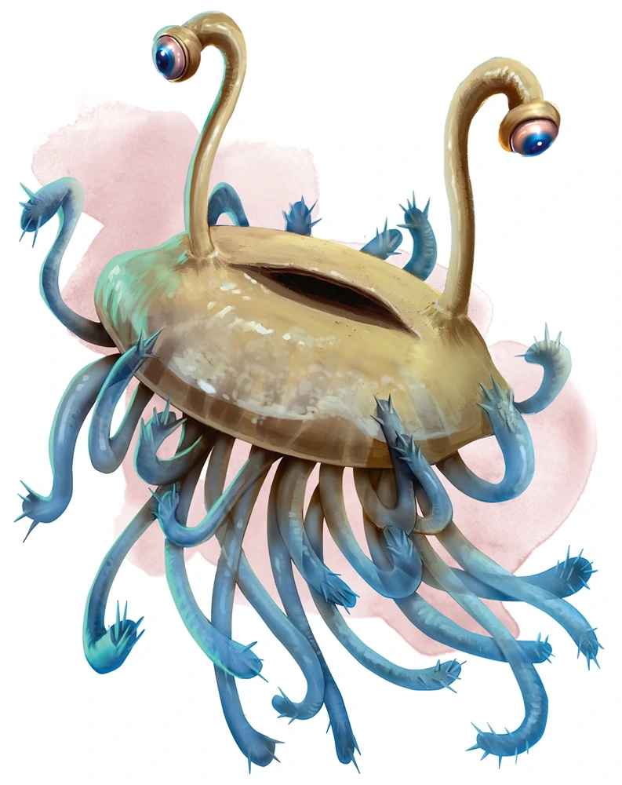

# Session 29

Date of session: **13/02/2023**

- [X] Anthony (**Jasper**)
- [X] Tom (**Sargon**)
- [X] Brecht (**Halkin**)
- [X] Martijn (**Svenn**)

**Disclaimer**: geen spellcheck of grammar check

## Alussiarr extra info

Als hij het heeft over **Arcturia** haar phylactry, zegt hij dat er 7 apprentices zijn van **HAlaster**  
**Arcturia** is de sterktse en gefocused op **Transmutation**.  

Phylactry:
- is er maar 1
- kan de mage mee regenereren

**Sargon** vraagt aan **Jasper** wat een phylactry is.

> Het is een bindingsmiddel van een mage die een lich wil maken.
> Arcturia is een lich

Wat iseen lich?

> Weinig wizards kunnen het, nog minder doen het ook echt.
> Ze worden onsterfelijk, maar leveren er wel iets voor.

Julile zien er avonturiers uit.  
Ik geef je al een kleine waarschuwing:
- Het volgende level is onder beleid van een dead tyrant

Hij en **Hallaster** hebben samengewerkt om van het volgende level een hindernissenparcour te maken.  
Voor avonturiers te testen of ze wel klaar zijn om het laatste level te halen.  

Dead Tyrant:
- een getransformeerde beholder "undead beholder"

**Netherskull** (dead tyrant) en **Halastar** hebben vroeger gevochten.  
Hij heeft **Hallaster** het wel moeilijk gemaakt, ze hebben samen afgesproken dat hij het volgende level mocht krijgen en mag testen.  

Als laatste zegt hij nog: "laat die twee dansende personen best met rust"

**Alussiarr** 

## Exploring the bedrooms

### 39B

Randen van een spiegel met een gravering erop 

### Portal / Gate Discovered (Level 14 -> Level ???) --> 3 Stick Figures holding hands 

De poort opent, we kunnen er niet door.  

We zien door de poort:

> We zien een zijaanzicht van een vrij groot standbeeld.  
> Het begint te gloeien.
> Lichtjes voorovergebogen, lange mantel, baard

Lijkt heel hard op **Halaster** 

### 39C

2 Dansende mensen zijn aan het dansen op de muziek van een magische harp.

  Detect Magic

> De dansende mensen geven een aura van transmutatie af.

We sluiten de deur van de dansers en laten ze met rust.  

### 40a

In het midden van de kamer staat een levensgroot standbeeld.  
Een standbeeld van een dwarf met platemail en een shield.  
Transmutation magic.  

## Sargon leads the way

**Svenn** gaat (met lichte tegenzin) mee.  
**Jasper** twijfelt aan de levenskeuzes van **Sargon*.  
**Halkin** lijkt de kant van **Svenn** en **Jasper** te volgen.  

Terwilj we naar 41 wandelen, gaat de deur van 33 open.  
Iets klein komt daar uitgevlogen.  

Een *flumph*

 Perception Check: 5

Uit de kamer waar hij uitvloog, horen we iets roepen (in een ombekende taal).  
Daarna horen we voetstappen ( een hele hoop )  

 Roll for Initiatve

**Doomcrone**:

> Indringers, jullie gaan me niet van de troon stoten!!!

Ze chargen op commando van hem.  

**Doomcrone** gaat lopen na een hevige fireball van **Jasper**.  
Hij loopt een kleine kamer binnen (33) en probeert de volgende deur te bereiken.  
**Sargon** zet de achtervolging in.  

Hij weet hem enigszins in te halen.  

We weten **Doomcrone** te overtuigen om zich over te geven door hem te intimideren en te overtuigen.  

## Tapestry room

In de kamer waar we **Doomcrone** hebben vermoord, hangt een grote tapestry met daarop een mooie afbeelding van een crystallen grot.  
Verspreid in de kamer staan een aantal (7) stalagmiet achtige rotsen staan.  
Sommige zijn afgewerkt maar nog niet allemaal.  
Op een van de tafels liggen mason tools.  
Een fauteuille met voetsteun staat in de hoek van de kamer.  
Er staat nog een stenen kistje.  
Vooraan het bed staat een kist, die open lijkt.  

**Sargon** opent de kist.

Loot

- ~5000gp~
  - ~1250~ per persoon~ *added op dndbeyond*
- Electrum vaatje (14 - 33)
- Tin kaarsenhouden
- Rode mantel (zijde)
- Koralen standbeeld van een schip dat over een golf vaart
- Gereedschap (baardkam)
  - bezet met edelstenen
- Platina kroon met zwarte parel erin
- Helm van elven makelijk (bedekt met bladgoud en een spiralen hoorn van amethyst)

**Halkin** komt erachter dat hij al zijn goud kwijt is.  
Van toen hij door de poort sprong en zich lichter voelde.

## Strange cubes and beheaded creatures

Naast de poort staan stenen pilaren.  
Daarop zijn ogen zonder ogleden gegraveerd.  

We komen aan in 29.  
In de twee hoeken van de kamer zien we twee grote standbeelden van ogres die in vliegen aan het transformeren zijn.  
In het midden staat een grote stenen tafel:
- Kleine zwarte kubus (bedekt met een deken)
- Een hoofd waar een deel tentakels uit de mond komen met een plas bloed erbij => lijkt op een *mindflayer*

De vloer waarop we staan is verbrand.  

  Detect Magic

Ondertussen:
 - **Svenn** luistert slecht aan een deur
 - **Svenn** bekijkt de gang, maar ziet er niks speciaal in, hij probeert met zijn voet een trap (zie P) te triggeren

 Wisdom Save: 16

Een witte flits gaat af.  
**Jasper** komt de hoek om gelopen.  
**Svenn** is nergens te bespeuren, hij staat nu oog in oog met een *owlbear*.  

Na een (redelijk hoge) dispell magic weet hij het ongedaan te maken en ben ik terug.  

> We moeten dus uitkijken voor *Polymorph* traps.  

**Sargon** raakt de kubus aan, maar er gebeurt niks.  
Hij inspecteert de kubus.  

Ongeveer een 30cm x 30cm kubus gemaakt van een ebony frame met zwarte glazen wanden.  
Een scharnier kan de kubus openen door een van de panelen te openen.  

**Sargon** neemt de kubus mee.  
~~**Svenn** neemt het leer van een *doppelganger* mee.~~
**Svenn** neemt de leren doek niet mee.    

Onder de tafel zien we nog een luikje open staan.  
Het compartiment is leeg.  

**Halkin** wandelt richting de deur van 31.  

 Wisdom Save: 13

Een transmutation circle licht op, een gigantische lichtflits verlicht de gang.  
We staan oog in oog met een fire elemental.  

 Roll for Initiatve

In een van de hoeken van de kamer zagen we een glimps van een persoon net voor **Halkin** in een fire elemental veranderde.  
In de kamer zien we in het midde nva nde kamer een poel van zwarte slijm liggen (moeilijk herkenbaar).  
Een human staat in de verste (oostelijke) hoek, hij staart in de verte terwijl hij aan het kwijlen is.  
De muren zijn bedekt met graveringen van zwarte tentakels.  

We probeerden de persoon uit zijn "trance" te halen maar het lukt niet.  
**Svenn** krijgt een licht gevoel van Evil uit de kamer, met zijn detect good and evil.  
Zelfs een *protection of good and evil* krijgt de persoon niet uit zijn trance.  

**End of Session**