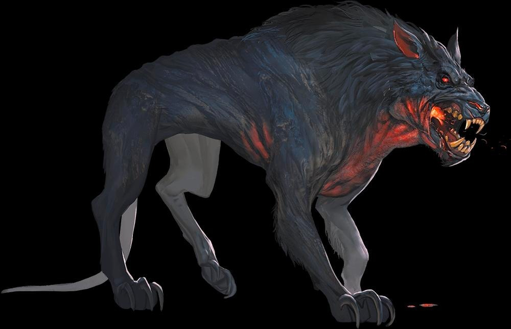
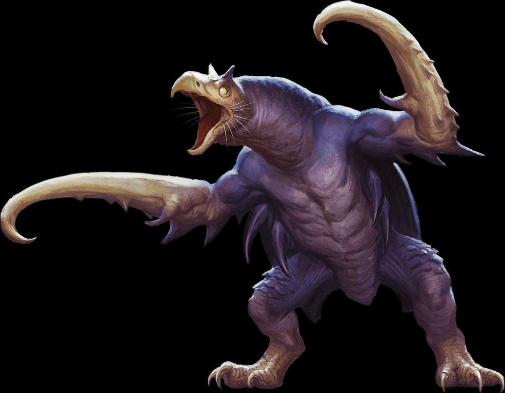
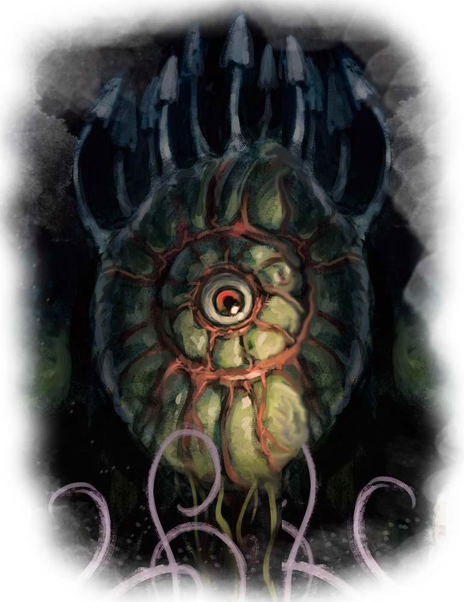
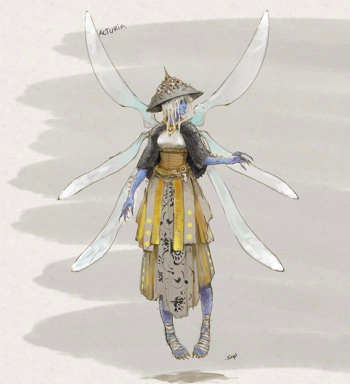
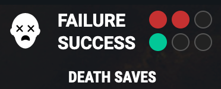

# Session 32

Date of session: **13/03/2023**

- [ ] Anthony (**Jasper**)
- [X] Tom (**Sargon**)
- [X] Brecht (**Halkin**)
- [X] Martijn (**Svenn**)

**Disclaimer**: geen spellcheck of grammar check

## Standing in the room with a lot of shelves

 Perception Check: 14

> In de verte horen we een vrouwelijke stem. (onverstaanbaar)

We bespreken of we weg zouden gaan.  

> De opmerkzame zien rook van onder de deur komen. 

We gaan terug van waar we komen.  

## Ambushing the ovens

We gaan terug richting kamer 13.  
We willen de geheime gang terug ingaan.  
  
Terwijl we door de gang wandelen, hoe warmer de ruimte wordt.  
Dichter bij de deur zien we de rode gloed onder de deur komen.  

De warmte is nog draagbaar in de gang.  

We doen de deur open. We worden overvallen door een onaangename hitte.  

**Halkin** sneakt de kamer binnen.  

Verschillende honden zijn de ruimte aan het patroullieren.  

## The long way round

De zonnewijzer in 21 is versprongen naar de maan.  
We kunnen er wel gewoon doorwandelen.  
  
Tussenstop in 28.  
**Halkin** probeert door een kier de kamer in te kijken.  
Hij ziet niets, maar hoort wel geritsel.  
  
**Jasper** ziet wel dingen in de kamer zitten (langere afstand).  

Het lijkt alsof het een grote kip/kalkoen is.  
HEt is wel heel groot met gigantische haken waar de handen zouden zijn.  

Zou het ons aanvallen?  
Nog voor we het kunnen ontdekken, tijdens ons overleg, valt het ons aan!  

 Roll for Initiatve

We kunnen de kip verslaan, maar na de killing blow begint het te krimpem.  
Een *hobgoblin* lijk ligt er in zijn plaats.  
  
Was het een polymorph.  

Wat ligt er nog in de kamer?  
Voor de rest is er niet veel te vinden.  

## Clearing the small rooms

20  
Dooie *hobgoblin* guard ligt er nog altijd voor de deur.  
We trappen de deur in, er liggen veel tonnen en kisten.  
Niks magisch.  
In de tonnen zit veel water en zakken met bloem, ..  

Proviant kamer.  

 Perception Check: 13

De andere zien een klein beestje/rat in de hoek van de kamer kruipen.  
**Sargon** probeert met kaas de rat in de doos te lokken.  
Lukt niet meteen.  

**Halkin** en **Svenn** raken lichtjes gefrustreerd van de aanpak.  
**Halkin** probeert op de rat te schieten.  
Het lukt.  

We steken de dode rat in de kist.  
Er gebeurt niks.  
De dode rat zit er nog altijd in.  

32b  
In een vrij grote kamer zien we nog wel wat bedden en bedrolls liggen.  
  
32c    
Hetzelfde, maar hier staan wat meer meubels in.  

32a  
Een hele hoop houten stapelbedden.  
  
34  
In de verte zien we iets zweven in het midden van de kamer.  
Een soort balletje met een oog erin.  
Vrij groot / groen.  
Het ziet er wel levend materiaal uit.  
Plantachtig.  

Op een 25 ft afstand, ziet **Svenn** het zich focussen op mij en we horen allemaal een hele felle schreeuw door de ruimte.  
Instinctief gooit **Svenn** zijn handaxe ernaartoe.  
Het oog ontploft, een groene gaswolk komt vrij.  

 Constitution Save: 15

  
4  
In het midden van de grote kamer zien we een grote ijzeren hendel die in een grote plaat verzonken zit.  
Zeven inkepingen zitten in de plaat.  
De hendel zit in 1 van de inkepingen.  

In een van de 7 cellen aan de muren zien we een ogre liggen.  
Het lichaam zit vol met pijlen.  

De rest van de cellen zijn leeg.  
  
6  
Een aantal grote inkepingen, in een van de inkepingen zien we niks, in de andere zien we een groot standbeeld.  
Een hoog standbeeld van ongeveer 10ft hoog.  
Ervoor ligt een transmutation magic circle.  
Een skelet achtig figuur met 6 smalle vleugels.  
Lijkt wat op een combinatie van een faery met een mens.  
Is het *Arcturia*?  
De inscriptie onder aan het beeld zegt van wel.  

7  
In de inkeping zien we een groot standbeeld staan.  
Een levensgroot standbeeld van *Halaster* staat in de kamer.  
Het beeld van *Halaster* staat precies alsof hij een spreuk wil casten.  

 Perception Check: 15

Verschillende ogen staan op de mantel van *Halaster*.  
Een ervan lijkt erop dat je kan drukken.  
**Sargon** drukt op de knop.  
Een steen verschuift en iets metaal valt op de grond.  
Twee blauwachtige sleutels zijn op de grond gevallen.  

> De F sleutel van het wapen
> De V sleutel van het wapen
  
8  
Verschillende cryptes / sarcophagen staan in de kamer.  
Het is een vrij lage kamer.  
De muren en de sarcophagen zijn bedekt met een schrift wat we niet helemaal kunnen lezen. (vervaagd)  
Het lijkt wel een dwarvish encryption.  
Geen nametags / inscripties.  

## Onto the forges

9a  
We benaderen de ruimte, we horen een hele hoop gelach en gebulder uit de ruimte komen.  
We stampen de deur open.  

We vallen een duel binnen zo lijkt het.  
De zwaarden zien er geen echte zwaarden uit, maar houten playsword.  
Als we binnevallen grijpen ze naar hun echte zwaarden.  
6 *hobgoblins* vallen ons aan.  

 Roll for Initiatve

Een van hen ging lopen en haalde versterking.  
Een grote groep hobgoblins komt naar voren gelopen.  
  
Na heel veel damage te tanken, gaat **Svenn** neer, *Fire Giants* zijn duidelijk zijn nemesis.  
Een *mass healing* word van **Sargon** haalt **Svenn** weer terug van de doden.  

Net op tijd of het was RIP.  

De *Fire Giant* gaat wel voor de kill als ik weer opsta.  
Hij treft raakt bij zijn tweede slag.  

9c  
Voor de rest geen andere zaken te vinden.  
In het noord-westen is nog een klein deurtje.  
  
9a  
Niks, alleen een deur  
  
9b  
**Svenn** vlamt de deur open.  
In de verte van de kamer staat een sarcophaag.  
Dichterbij zien we dat het ee ngranieten sarcophaag is.  
Spinnenwebben bedekken de sarcophaag, hier kwamen duidelijk geen andere personen.  
De inscriptie is bedekt met stof, **Svenn** kuist het proper.  
De inscriptie:

> U heeft de laatste rustplaats gevonden van : Harlsnod Darkshine
> Architect, trappenmaker, drinker van verfijnde bieren  

De versiering, is van de **Melairken** dwarves.  

## Carrying on even when low on health

On to 10 we go.  
We lopen door de lange gang richting 10.  
**Svenn** heeft wel ondersteuning nodig.  

Als we de hoek omgaan zien we in het midden van de kamer een tafel met stoelen rond staan.  
Op de tafel ligt een grote tankard, die erop gevallen is waardoor de tafel kapot is.  
In de twee hoeken van de kamer staan twee standbeelden.  
Vrij kleine standbeelden, 2ft. Twee dwarves.  
Allebei houden ze een drinkbeker/tankard in de lucht.  
Geen inscripties of iets dergelijks te vinden.  
Een ervan is een vrouw.  

 Perception Check: 25

**Sargon** valt het op (als hij wat hoger gaat staan om te kijken), dat er in een van de cups iets ligt.  
Hij haalt het eruit.  

> De H sleutel van het wapen

We merken dat een gloed uit de andere gang komt, warmte overvalt ons, maar het is nog aangenaam.  

### Setting off a tactical nuke

We gaan naar de nuke control room.  
We steken stillaan de sleutels erin.  
Een geluid begint te zoemen in het midden van de kamer.  
We zien een of andere spell die begint te activeren.  

Iedereen gaat in de inkepingen staan van de ruimte.  
De energe bouwt op, de kamer vult zich met energie.  

Voor de inkeping stopt de energie.  
Na enige tijd horen een shockwave, en in de verte precies een grote knal.  

Het licht neemt af, het gebrom stopt.  

We gaan naar een plaats waar lijken lagen.  
De lijken zijn verdwenen.  

De deur waar zombie dude zat (31) staat open.  
Vanaf dat we de deur passeren zien we 2 "klein" blauwe draken staan.  
Ze zien er volledig bebloed uit, met opgebrande vleugels.  
Ze roepen nog:

> Jullie gaan hiervoor boeten

 Roll for Initiatve

Het valt ons tijdens het gevecht op dat er voor de rest geen enkel omgevingsgeluid meer is (zoals de harp)  
De breath weapons doen veel schade aan.  
**Halkin** gaat neer.  

Het lijkt alsof het wel gewerkt heeft.  
To be found out.  

**End of Session**