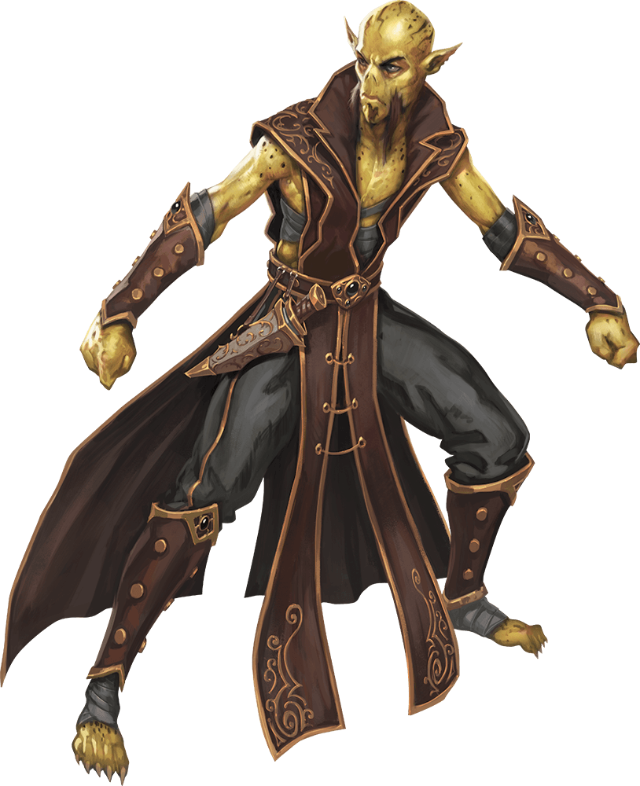

# Session 33

Date of session: **10/04/2023**

- [X] Anthony (**Jasper**)
- [X] Tom (**Sargon**)
- [X] Brecht (**Halkin**)
- [X] Martijn (**Svenn**)

**Disclaimer**: geen spellcheck of grammar check

## Did the nuke work?

De man met zijn brood is weg, er is geen spoor meer van te vinden.  

Checking the "boss" room.  
Of er nog iets leeft.  
  
We staan aan de deur, waar nog een deuk in zit en een grote rode bloedplek van **Svenn**.  
  
**Halkin** probeert stilletjes de deur open te doen.  
Samen met **Sargon** krijgen ze de deur op een kiertje.  
Ze zien wel dat er nog licht in de kamer is.  

De deur gaat niet echt stil open, maar als ik kom helpen gaat ze wel open.  

Meteen als de deur opengaat, horen we een vrouwlijke stem iets roepen.  
We verstaan het niet meteen.  

In een lange hal tussen de vele pilaren zien we een heel groot metalen standbeeld staan (nog in constructie).  
Een vrouwlijke *fire giant* staat in het midden van de kamer.  
Ze ziet er slecht uit, maar is wel woest.  
Rond de standbeelden staan er nog 3 fire giants.  
  
Een grote fire bolt komt op **Jasper** afgevlogen.  

 Roll for Initiatve

We lopen om terug naar de kamers van 19 om ze via een side deur aan te vallen.  
  
**Halkin** doet de deur open en kijkt de kamer in.  
Hij ziet vrij weinig, de *Fire Giants* kan hij nu niet zien. Hij kan nog net het grote standbeeld zien.  

Vanaf dat hij de hoek omgaat, ziet hij de *fire giant* vrouw iets roepen en naar hem wijzen.  
Onmiddelijk komen er een fire bolt en een aantal ijzeren platen naar zijn hoofd geslingert.  

**Halkin** gaat neer door een van de ijzeren platen en rolt 10 feet naar achter.  

Het gaat echt te moeizaam, **Jasper** gaat ook neer.  
We besluiten te gaan lopen richting de *desintegration room*.  
Met dank aan 
Inivisbility
 kunnen we naar de room gaan.  

Nu gaan we richting **Zox**.  

## Resting @ Zox's place

We komen bij hem aan, maar we kunnen hem niet onmiddelijk vinden.  
We passeren door de ruimte van waar de smede het ijzer aan het bewerken zijn.  
**Zox** ziet ons binnenstrompelen.  
We begroeten hem.  

We lichten hem in dat we *hobgoblins* en *Doomcrone* hebben aangevallen en uitgeroeid hebben.  

We kunnen wel een rustplaats / onderdak gebruiken.  

Hij wandelt mee en omdat we toch geholpen hebben mogen we tijd nemen om te bekomen in zijn huis/woning.  

**Sargon** helpt **Zox** hier en daar met wat klusjes en smeedwerk.  
**Svenn** update zijn diary en journal.  

De dwergen zijn ook op de hoogte gebracht van onze avonturen en dat we een nieuw dwergen level proberen te clearen voor ze.  

Na 2 dagen te bekomen, willen we weer verder.  
**Zox** heeft tot nu toe geen last van de *hobgoblins*.  
Hij weet niks van de *fire giants* af en wat ze aan het doen zijn.  

## Back to the doomsday level  

Het grote standbeeld is weg.  
Zittend met humanoid features.  
De hele kamer is leeg.  
Op het einde van de kamer zien we nog wel.  
  
Hier en daar liggen nog stukken schroot waarmee het gebouwd is.  
  

 Investigation Check: 24

  
We zien dat er een grote cirkel op de grond getekend is.  
  

  Detect Magic

  
Achterin de kamer zien we een put.  
Onderin staat een stenen sarcophaag.  
In het dwarvish staat er een inscriptie op:  
> Hier ligt Lulz Klangphorn, trapmaster he is survived by his work

De detect magic geeft een restanten van *conjuration magic* af.  
  
Teleported statues?  

We gaan verder naar de forges.  

## Off to the forge we go met een detour

In 17 zien we 5 vrij grote lange tonnen staan met daaraan handvaten.  
Als we eraan voelen klotst er vloeistof.  

**Svenn** en **Sargon** noteren het.  

In de volgende ruimte zien we 3 sarcophagen.  
3 humanoids remains liggen in de sarcophagen.  
De lichamen lijken te lang voor dwarves.  

11:  
Als we de deur opendoen komt de hitte ons tegemoet.  
In de kamer staan een hoop tools, smithing irons etc.  
Maar voor de rest is het vrij leeg.  
  
**Sargon** hoort de crackle van een forge in de verte.  
Hij weet dat het actief is maar voor de rest hoort hij niet veel.  

De warmte van de forges komen ons tegemoet de hitte overvalt ons een beetje.  
**Sargon** heeft er minder last van.  

In 12c kunnen we nog niet meteen iets zien.  
We zien een put in het midden van de kamer.  
De forges branden nog, maar er lijkt niemand meer in de kamers te zijn.  

We onderzoeken de pit:  
- 10x10 ft put
- 70ft diep
- Onder uit de put komt nog hitte
- Er ligt vooral afvalresten in

Bij de forges komt er wel meer hitte uit.  

**Halkin** wordt een messenger en waarschuwt de dwarves:
- Er is weer een level veilig, zend troepen om het in te nemen.  
- Zox is vriendelijk en laat jullie wel door
- Reclaimen boys
- Let op met de sundial room, die kan u wel een schok geven
- Traps (dwarven-made)

Hij ligt **Zox** ook nog even in dat het kan zijn dat er een dwarven leger komt passeren, maar dat kan nog wel even duren.  

De dwergen gaan een bataljon klaarmaken, maar het kan nog wel even duren.  

**Halkin** komt terug bij ons aan.  
We lopen richting de trap naar het volgende level.  

## Level 15

We komen in een grote ruimte met 4 grote pilaren die de plafond omhoog houden.  
Standbeelden, 12ft hoog van Hallaster staan aan verschillende kanten van de kamer 4 identieke pilaren.  
In de kamer staan ook nog 2 mijnkarretjes.  
  

  Detect Magic

  
  
De standbeelden hebben een gloed van transmutation magic.  
Een ietwat oudere stem zegt:
> Welkom in het obstakelparcour, leg jullie wapens en magic items in de mijnkarretjes voor safe keeping

De stem lijkt op die van **Halaster**.  
We beslissen om het niet op te volgen.  

**Jasper** vertrouwt het allemaal niet meer.  
Hij gaat terug naar *Skullport* om meer info te vragen bij de 2 neefjes met de kaarten.  

**Jasper** weet dat er teleporting traps waren, de uitgang heeft een van de neven aangeduid.  
Ze hadden hun equipment aangehouden en wapens ook.  

We houden de gear gewoon aan.  
**Jasper** heeft een nieuwe *goblin* vriend.  

Zijn *goblin* noemt nu ook **Sargon**.  

Na een paar dagen komt **Jasper** terug met **Sargon** (G).  

## Level 15

We horen weer de melding van de items.  
We negeren de boodschap.  
De *goblin* moet zijn wapens wel in de kar leggen.  
We wandelen naar het Noorden.  
Vanaf dat de *goblin* (**Sargon**) de standbeelden passeert zien we een felle lichtflits.  
We hoorden *Halaster* zeggen:
> Teleported

**Halkin** wandelt naar voor, en hij wordt ook teleported.  
**Svenn** volgt en komt bij **Halkin** uit.  

### Svenn en Halkin

We komen in een grote ovalen kamer terecht.  
In een van de hoeken zien we, een groot standbeeld staan.  

 Dexterity Save: 17 en 19

Aan de oostkant van de kamer staat een drakenbeeld.  
Het komt op ons afgerold, we springen nog net op tijd aan de kant.  
Na het ontwijken rolt het terug naar achter.  

Tegenover en rechts van het standbeeld zijn er twee doorgangen.  

We gaan naar rechts.  
WE komen in een lange gang, op het inede een T splitsing.  
En nog een gang naar rechts.  

We gaan nog eens naar rechts, het eerste gangetje in.  
Een vrij korte ruimte loopt naar links af en loopt dood.  

We wandelen naar het T-stuk.  
We kunnen daar naar links en naar rechts.  

We gaan weer naar rechts een doodlopende gang in.  
Na terug te wandelen gaan we nu de linkse gang in.  

Na het volgen van de gang komen we na wat buigingen een nieuwe T-splitsing uit.  

Nu kiezen we voor links, dan buigt het naar rechts af en we kunnen ze blijven volgen.  
We draaien weer naar rechts en komen weer op een gang uit waar we naar links en rechts kunnen.  

We nemen de aftakking naar links.  
We lopen de lange gang in.  

De gang buigt af naar links en komt uit op een langere gang.  

Aan de rechterkant 2 opslitsingen (MET DEUR).  
De eerste deur leidt naar een vrij kleine ruimte.  
Voor we ze opendoen ziet **Halkin** een dwarven rune staan.  
**Svenn** ziet dat het een symbol of death is.  
In de deur staan ook schedels gegraveerd.  

Op naar de tweede deur.  
Hier staat hetzelfde symbool op de deur.  
In de deur zit een driehoekig gat.  
Soort van kattenluik.  

We late nde deur dicht en lopen verder de gang door.  
Na een passage die naar links afbuigt komen we weer op een deur.  
We gaan de deur binnen.  
Vanaf we ze opendoen licht de gang op en warmte komt de ruimte binnen.  
Als we naar links kijken zien we nog iets of wat van muur maar recht voor ons en rechts is grote delen van de kamer verwoest en komt uit op een ravijn.  
Waar veel lava en magma in ligt (warmte).  

In het midden van de muur aan de linkerkant zien we een heel grote boog staan.  
Met een honderd tal puzzel stukjes die eraan gemonteerd zijn.  
Kunnen losgemaakt worden.  

### Portal / Gate Discovered (Level 15 (??) -> Level ?? ())

In de verte zien we een iets of wat spectrale brug.  

Er zijn geen opties meer.  
We wandelen helemaal terug naar de draak.  

### Jasper en Sargon

**Sargon** en **Jasper** staan aan een doodlopend eind.  
Ze zien een hoek die naar rechts afbuigt.  
Ze staan in een gang.  
Als ze naar links gaan komen ze weer terug in de eerste kamer.  

Ze worden weer geteleporteerd.  
Ze wandelen naar de grote ruimte.  

Verschillende graveringen van dwergen die smidswerken aan het doen zijn.  
In de ruimte zijn veel sleepsporen van meubels die weg gesleept zijn.  

Er ligt niet meteen iets interessants in.  
Geen detect magic hits.  

Ze gaan richting het zuiden.  
Vanuit de noordelijke muur zien ze een maanvormig fontein.  
Af en toe komt er wat water uit.  

Onderaan zitten er gaten zodat het water weg kan lopen.  

**Sargon** drinkt eens van het water.  
YOLO  

Ze checken de westelijke kamer.  
Ze doen de deur open.  
In de hoek zien ze 4 *gith'rai* zitten met hun wapens getrokken.  

Ze stellen hun voor aan **Sargon** en **Jasper**.  
Een ervan is **Ir'lakka** de leider van de groep.  
**Azal** en **Vond** en **Reginar** zijn er ook.  
  
Ze zeggen ook dat ze een van hun party members kwijt zijn. **Erzai**.  

Ze zoeken wat companen die hen kunnen helpen om hen te verenigen met de rest.  

Ze zoeken hulp met hun conflict.  
Githyanki vs Mindflayers vs Githzerai.  
Githzerai (good) vs Githyanki (evil)  

Ze zijn in de omgekeerde weg de dungeon aan het doen?  
Ze wonen lager.  

Vanuit de *underdeep* kunt ge in de *undermountain* geraken.  

**Jasper** en **Sargon** beslissen om hen te helpen.  

Ze weten niet meteen wat er nog allemaal in de andere ruimtes te zien is.  
Daar zit blijkbaar een gevaarlijke teleportation trap.  
De kamer van de fontein.  

Ge *githzerai* beslissen om na een rest op zoek te gaan naar hun compaan.  
**Sargon** en **Jasper** gaan met hen mee naar hun compoanion te zoeken.  
Ze wachten tot ze klaar zijn.  

Ondertussen checken ze de noorderlijke kamer.  
Daar is hun rust kamer met wat bedrolls.  

**End of Session**

Voor volgende sessie:

- Halkin en Svenn, wandelen weer naar de draak
- Jasper en Sargon, wachten samen met de gith om verder te gaan