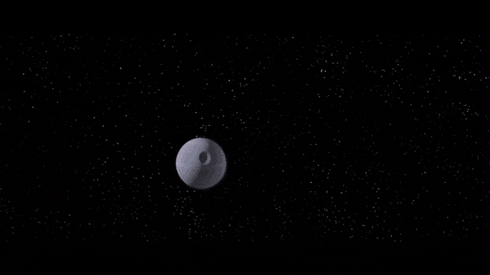

# Session 38
Date of session: **30/12/2024**

- [ ] Anthony (**Jasper**)
- [ ] Tom (**Sargon**)
- [ ] Brecht (**Halkin**)
- [ ] Martijn (**Svenn**)
- [ ] Kimberley (**Zelda**)

**Disclaimer**: geen spellcheck of grammar check
# Preparing for battle with Mecha-Hallaster

We krijgen een oud landhuis van Lady Wayland.
Het is aan de rand van Waterdeep.

Soort van Mansion achtig, wel achterhaald. Gaat we moeten renoveren.

Dit kunnen we als uitvalsbasis gebruiken

## Information gathering

Hoe gaan we met de threat dealen?
We weten dat het vanaf het **Oosten** zal komen.

We vragen hulp aan de clan van **Sargon**.
- Ze hebben wel siege equipment, meer dat is maar gewone stenen. 
- Dus die zijn beter tegen de giants want het is niet magical imbued dus dat gaat weinig nut hebben op de mecha hallaster.

Er zou een exhaust moeten zijn die de heat dissipate zodat de mecha niet oververhit. 
Misschien kunnen we hier wel een bom oid in mikken.
(Death Star gewijs)

**Glystar** ging ons ook nog helpen in het gevecht.

### City Guard / Gryffon Squad

**Jasper**  gaat op zoek naar de **Griffons** , de **City Guard** gaat ze controleren en vooral focussen op de giants. We zouden er eventueel wel een aantal kunnen “lenen”.

### Lady Wyland + Glystar

Lady Wyland zal de stad mobiliseren en optrommelen om te zorgen dat iedereen gewaarschuwd is. 

### Zox

**Sargon** en **Sven** gaan naar Zox om te vragen of hij kan helpen of eventueel iets heeft wat nuttig kan zijn. Daar zijn we een paar uur mee kwijt. Als we bij Zox aankomen, merken we dat de Das er nog altijd is. Hij is nog vriendelijk en herkent ons. Als we naar buiten gaan, merken we dat de metaal productie stil ligt. Ondertussen is zijn poort af!

De poort was operationeel… 

Zit **Zox** in mecha-hallaster???

We gaan **Zelda** halen om met de **Das** te gaan praten.
**Sargon** neemt tijd om even naar **Daelar** en **Fae** te gaan om ze te gaan groeten en respect.

**Sven** ontploft half met door de poort te springen.

**Zelda** verandert in een das en probeert met de andere das te praten.

**Sargon** Cast locate creature om **Zox** te vinden om hem binnen de 1000ft. 
Zwakke ping boven ons.
We zetten de achtervolging in voor **Zox** te vinden.

We gaan naar level 6.
Geen ping meer.

We gaan weer terug level 12. 
Ping op dit level.

We kijken naar rechts als we uit de kamer komen.
In de verte zien we een omkasting waar Zox zou moeten zitten.
Hij zit in de burcht.

We gaan er naartoe. 
In de verte zien we veel beweging aan de poorten van de burcht.

Het lijken kleinere humanoids maar we kunnen het niet ingeschat van zo ver.

**Zelda** verandert in een vleermuis zodat ze kan zien wat er in de burcht is.
Ze kan telepatisch met ons communiceren zolang ze binnen de 60ft blijft van ons en ons kan zien.

> Heel veel bedrijvigheid. Tegen de muren oplopen, … Het lijken schorpioenen.
> In het midden van het plein ziet ze een klein gestalte van alles uitleggen en communiceren.
> Voor de rest valt er niet meteen iets op.

Ze vliegt terug en deelt het mee.
Van zodra we horen dat het schorpioenen zijn en **Zox**, gaan we er naar toe.

Als we de burcht benaderen:

~ Roll for initiative ~

Na een korte “combat” weet **Sven** de guard te overtuigen om ons door te laten en **Sven** weet **Sargon** te redden van certain death by scorpion. Door brute force de klauwen te openen.

Wat doe jij hier Zox? Ik dacht ge een portaal ging nemen?

Z: Die portal is enkel om te clonen , niet om te reizen. Enkel constructs, geen levende wezens :-(

Wat brengt je naar dit level?

Z: In samenspraak met de Dwarves. Het was moeilijk om hier een vaste post van te maken. Voor mij is het makkelijker om dit veilig te houden. Dus ben ik naar hier verhuisd. Ik ben nog aan het inrichten. Ik laat de das niet achter hoor. :)

Informatie

> Als we eerder waren had hij misschien wel nog wat tips en tricks, maar zo kort dag kan hij niet meteen iets helpen. Als hij met zijn leger naar boven moet komen gaat het te lang duren.
> De robot van 100 ft afremmen of stoppen? Afremmen gaat niet simpel zijn. 
> Tunnels gaan hem niet vast zetten, maar misschien wel laten vallen/vertragen.
> Ketting rond de benen moet wel een heel stevige ketting zijn.
> We willen proberen de exhaust poorten te blokkeren? Daar kan wel iets inzitten. Het zal waarschijnlijk heel sterk zijn. De arcane power die vrijkomt moet hiermee vrijgelaten worden. Dichtlassen is geen goed plan, het is heel hittebestendig.
> Met een construct moet ge oppassen. Die hebben vaak een damage threshold… Dus weak damage gaat niet veel doen.
> Roest? Over heel lange tijd? Als we een sneeuwstorm veroorzaken? Leger rustmonsters? Te traag om het allemaal op te eten.
> Hoe zou het gebouwd kunnen zijn? Piloten? Als het aangevraagd is door Hallaster zal het waarschijnlijk een construct zijn, en niet bestuurd. Een van de leerlingen van Hallaster heeft de schorpioenen ook gemaakt. Waarschijnlijk een simpele taak, die het zal volgen en volbrengen.
> Aanraden: Misschien een decoy? Zodat we kunnen zien wat hij kan? En hem bestuderen…

Hulp

> Zou niet lukken en in Waterdeep gaan ze niet kunnen lachen dat we daar ineens met met schorpioenen boven zouden komen.
### Harpers

**Halkin** en **Jasper** gaan naar de Harpers.
Informatie?

> we kennen een hallaster maar geen mecha versie. Constructs is niet onze expertise.

Hulp?

> we weten niet hoe nuttig we zijn, want we gaan er waarschijnlijk niet een bij geraken. 100ft. Hoog is weinig aan te beginnen.

### Willow

**Zelda** gaat **Willow** 

Informatie

> Ze weet er eigenlijk niet veel van.

Hulp

> Ze focust zich op de natuur zelf, ze kent wel enkele spells. Misschien als je zaken in zijn pad kunt leggen om hem tegen te houden zou wel kunnen. Firestorm, Whirlwind?, Draconic Transformation, Wall of Thorns, Bones of the Earth

### Grondwerken Halkin

**Halkin** gebruikt zijn nieuwe gloves om de grond te gaan omploegen. Zodat als er iets zwaar op gaat staan, dat het zal wegzakken.
Theoretisch kan hij (incl. 2x dash) ongeveer 50 kuub graven (1,5 m x 1,5 m x 23 m) per 6 seconden.

Hij gaat 3 dagen lang 8u / dag graven.
