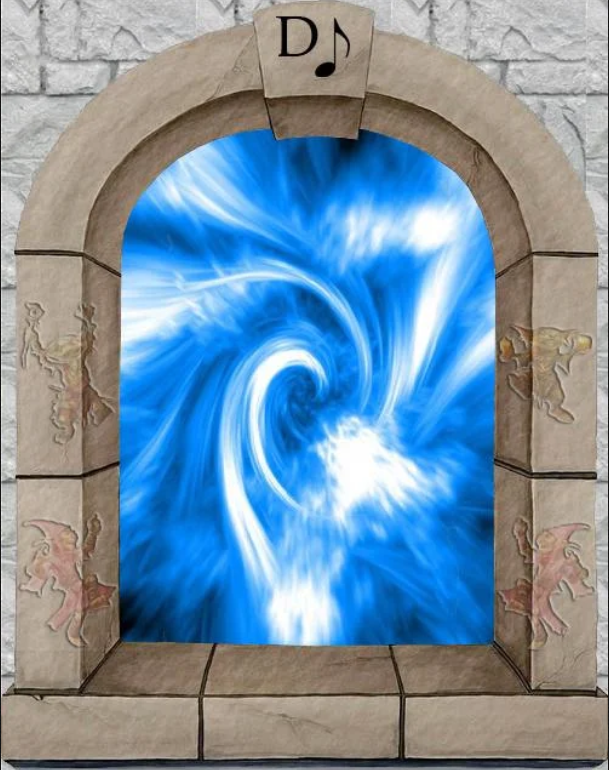
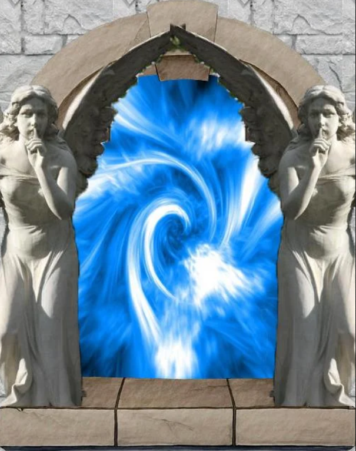
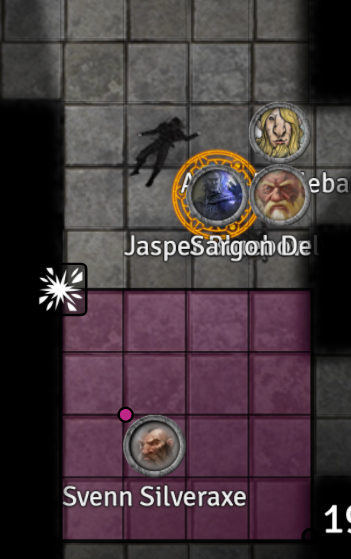
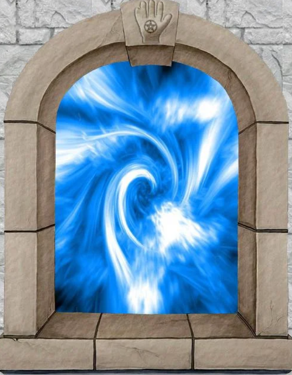
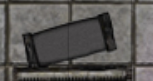

# Session 4

Date of session: **12/05/2021**

- [X] Anthony (**Jasper**)
- [X] Carl (**Alvyn**)
- [X] Martijn (**Svenn**)
- [X] Tom (**Sargon**)
- [X] Sofie (**Jade**)

**Disclaimer**: geen spellcheck of grammar check

## Regrouping at a trash compactor

After catching our breath, (and using a 45HP lay on hands).
We carry on.

## Sitting room?

In a big room we see stone benches.  
In the corners we see showerhads with rusted chains.

**Sargons** knows of a secret door.  
Ondertussen trek ik aan een ijzeren ketting.  
Er komt na een tijdje koud water uit.

Ik zet me op een bankje en begin in mijn boek te schrijven.  
De rest zoekt ondertussen naar een geheime deur.

## Secret door (Statue room)

Een kamer met een grote troon waar een dwerg op zit.  
Voor de troon is een put (15ft) met daarin een lijk.

Terwijl ze rondkijken in de kamer, valt hun oog op iets waardevols wat in de put ligt.  
De put is een valkuil die is blijven openstaan doordat een been vastzit in het mechanisme.

Ik word gestoord terwijl ik aan het schrijven ben, grumpy ga ik de rest van de party helpen.

Ik en **Jasper** houden het touw vast, **Sargon** daalt af in de put.

  ! Loot in de put !

- Mithil Peg leg

  ! Loot standbeeld !

- Gemstones in de stenen ringen
  - 2 sardonyxes
  - 2 zircons
  - 1 anmethyst
  - 2 garnets
  - 1 spinel
  - 1 tourmaline

## Sauna

Kleine cirkelvormige kamer.  
In het midden staat een grote koperen vat. (5ft diameter 8ft hoog)
Vanonder verschillende graten erin.  
Tegen de muur een uit zwart steengehouden bankje dat volledig de kamer omringt.  
Naast de koperen ton staat een verroest tandwiel.

**Sargon** draait aan het tandwiel.

 Athletics Check: 20

Er komt beweging in, water begint te stromen.  
Uit de ijzeren graten begint stoom te komen.

**Jasper** vraag om het terug dicht te draaien.  
**Sargon** gehoorzaamt en draait het weer terug dicht.

## Empty hallways

After carrying on to the north we find empty hallways with two semi-circular alcoves.

## Barracks

Stenen beden, hoofden tegen de muur.  
Opengebroken stenen kisten aan de voeten van het bed.  
Standbeelden in stukken geslagen.

Damn Drow!

## Exploding

De kamer is vernietigd.  
Over de grond en tegen de muren een heleboel zwarte roet.

 Investigation Check: 13

Een ontploffing in de kamer?  

## Corpse prep room?

Long table.  
Stenen taferelen met verschilende dwergen die tijd doorbrengt met zijn vrouw/kinderen.  
Afbeelding van **Melair**.  
Een stenen kist staat op een "bier" (lijktafel)  
De kist is vrij zwaart.

## Gateway room

Behind the corner, we find two dead dwarves (2 **duergar**).  

2 poorten:
- Noord: Muzieknoot

{:width="200px"}

- Zuid: 2 standbeelden

{:width="200px"}

Waar zijn de dwergen aan dood gegaan?  

 Medicine Check: 14

Man:  
Gebroken nek

 Medicine Check: 15

Vrouw:
Zelfde verwondingen (nek gebroken)

Ik benader de zuider poort.  
Here we go again

 Roll for Initiatve

Ik verlies 2 tanden tijdens het gevecht.

## Master bedroom

Kleine kamer met 7 lege inkepingen rondom.  
Wit marmeren bed. De hoekposten lijken op kleine dwergen.  
Aan het voet staat een kist (open) met daarvoor een dode duergar.

Wat is er met die duergar gebeurt.

 Investigation Check: 15

Enkele darts (poison). Het was een trapped trunk. De kist is leeg.  

We beslissen om een korte rust.

We horen gegiechel en trappelen van voeten uit de gang.

## Chasing the sound

Het gegiechel gaat de hoek om, verder naar het oosten.  
We achtervolgen het geluid.  
Ze zijn met ons kloten aan het rammelen, ze leiden ons rond.

## Spa time

We gaan de sauna in.  
Ik laat mijn spullen die niet tegen hitte kunnen bij de douches.  
Armor, battleaxe en shield neem ik mee naar binnen.  

**Sargon** laat alles achter en komt in zijn pure binnen.  
Wel een doek over hem.  

**Alvyn** komt ook volledig naakt (bedekt door een flesje) binnen.
**Tal** beschermt mijn boeken buiten de sauna

**Jasper** is ook zonder armor de sauna binnen gekomen.

Allemaal een **Relaxation** point (inspiration)  

Armor ziet er weer spik en span uit door de stoom. :-)

We proberen ondertussen terug te bonden.  
We delen allemaal onze goede en slechte momenten.  

**Sargon** waardeert het dat we bij hen zijn.  

## Toilets

Verschillende stallen met een gat in de vloer dat verdwijnt naar beneden.  

## Smashed displays

Een hele hoop vernietigde displays liggen verspreid door de kamer.  
Hier stond vanalles tentoongesteld, maar is vernietigd.  

## Hidden muur

"Hoe hier is een hidden muur" - **Svenn**  
Terwijl zijn hand door de muur verdwijnt.

Ik vertrouw **Sargon** zijn map en navigatie skills vanaf nu.  
Blijkbaar is hij toch te vertrouwen.  

Mental note:
- Do not trust gates (ambushes)
- Trust **Sargon** & **Jasper**

Vier glazen kastjes met stukken van een staf.  
Elke inkeping geeft een groen licht af.

**Sargon** breekt de glazen en probeert de stukken te combineren.  
Bij het gebruiken van mending, heeft **Sargon** twee stukken staf gemaakt.  
De laatste stukken kunnen niet aan mekaar gemaakt.  
Lijkt alsof ze niet samen horen.

We gaan op zoek naar de geheime kamer.

 Perception Check: 18

We vinden niks.  
**Alvyn** heeft meteen prijs.

"Geluk is voor de kleine mensen" - **Svenn**

## Hidden room

12 rottende botten zweven rond in de kamer.
Ik loop de kamer binnen.

 Charisma Save: 17

**Ik kan me niet meer bewegen, ik heb geen controle meer over mijn eigen lichaam.**

Ik draai me om en zeg:
"Kom binnen, dan deel ik een paar geheimen met jullie." (een andere stem met een echo)

Geheimen:
- Het hart van de berg is verzegeld achter deuren van zwart basalt die alleen een koning kan ontgrendelen.
- Als je een kamer binnenkomt, moet je het woord ‘xunderbrok’ zeggen, Je kan beloond worden.

"Het zijn zaken die ik door de jaren heen vergaard heb. Voor ik ga wil ik dit nog zeggen:"

- Demonen vielen onze tempel binnen, maar we hielden ze vast in standbeelden. Pas op voor hen.

Ik kom weer bij. Ik herriner me dat ik possessed was.  

Ik duw de rottende botten weg, slijm hangt naar beneden, maar ze hervatten hun patroon opnieuw.

## Music Room

Een **Duergar** staat in de kamer.
Hij laat zijn wapen zakken.
Een poort staat in de Kamer

{:width="200px"}

Paarse lichten.  
Koperen drummen met een "brass" Tuba.  
Tegen de zuidelijke muur staat een gigantische orgel.  
Een groot pijporgaan met gigantische stalagmieten en stene pedalen en toesten.  

**Sargon** begint op de trommels te kloppen om stevige muziek te maken.  
Het komt er vooral uit als kabaal.

Is that you **Nintendo**?

## Timeskip

We gaan terug en helemaal weer naar de bovengrond.  
We spreken af om mekaar weer te ontmoeten samen in de **Yawning Portal**  
Tijd voor inkopen en te regroupen.  
Ik wil mijn clan inlichten van wat ik gevonden heb.  
Er is geen hoop meer, we moeten bij **Hallaster** om retributie zijn.

Brief naar de familie van de gevallen party.  
Brief naar onze leidster: **Dagnabbet Waybeard**.  

**Sargon** verkoopt stenen en magic items. (magic items zijn voor hem. Stenen worden gesplit.)

Als we klaarstaan voor af te dalen, worden we benadert door een vrouw.  
Ze spreekt ons aan en zegt: "**Faye** heeft me gestuurd om de party bij mekaar te houden."  
We kijken alsof we een geest hebben gezien.

**End of Session**
