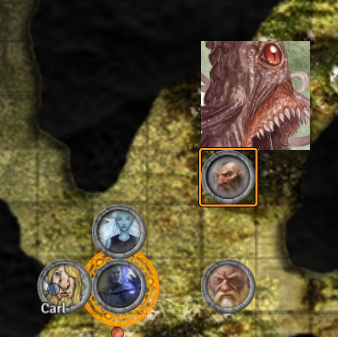

# Session 5

Date of session: **26/05/2021**

- [X] Anthony (**Jasper**)
- [X] Carl (**Alvyn**)
- [X] Martijn (**Svenn**) (later)
- [X] Tom (**Sargon**)
- [X] Sofie (**Jade**)

**Disclaimer**: geen spellcheck of grammar check

Missing the first part of the session. (see video of **Alvyn**)

## Level 1

### Encountering a giant cube?

De kamers en de gangen waar we doorlopen zijn verdacht veel properder.  
De deur die naar de kroon van **Hallaster** leidt heeft een blauwe kleur gekregen.

We worden verrast door een Gelatinous Cube.  

 Roll for Initiatve

Redelijk makkelijke fight.  

**Jade**? Gooit de lantaarn naar **Alvyn** en verdenkt dat de lantaarn het monster heeft opgeroepen.  

Een nieuwe vrouw is bij onze groep aangesloten.  
Wie is zij?  
De rest heeft haar geaccepteerd in de groep. Heel vreemd.  
Ze weet dingen over ons en wil ook(?) **Hallaster** vermoorden.

We komen in een grote kamer een zijaanzicht afbeelding van de volledige undermountain.   
In het midden van de kamer zit een put.

## Level 2

- Goblin Bazar
- Portal naar level 4 (goudstuk erin steken)

**Jade** kan niet door de poort?
Iedereen staat te discussieren maar niemand gaat door de poort.

Na lang twijfelen zeg ik alé het is goed, ik ga door de poort.

Ik ga door de poort. [level 4](#level-4)

We staan nu met vieren aan de andere kant van de poort.  
Is ze niet sterk genoeg.

"Ik dacht dat ge een **Ulfgard** ging doen" - Jade

**Jade** stelt zich voor als **Jade du Circuba** (genoemd naar het circus waar ze bij hoorde)

## Level 3

Skullport.  
We gaan naar het huisje van de 2 half-ling broers.  
We geven ons papier af en ze geven ons een bundel met de overige kaarten.

We hebben alle levels nu. (23).

### Level 4

We lopen door, terwijl vertelt **Sargon** over **Varys** en **Ulfgard** dat ze hier zijn omgekomen.

 Roll for Initiatve

**Jade** heeft zwarte tentacles die uit haar arm komen?

We hebben nog weet van andere portals.  
- Standbeelden met een gat erin de beeldjes moeten we erin proppen.

We komen bij de plaats van de ambush.  
De graven liggen er onaangeroerd bij.  
Ik giet per graf van de juiste waterskin uit op het juiste graf.  
Sargon zegt mooie woorden.  

> Kannag, men deyr gronit dok khagam menu
Kannag, men deyr gronit gok khagum menu
Men namads un men nadads
Kannag, men deyr gronit dok menu de baratj-al men khaham
Abat de zagaz
Kannag dey gronit urukhash menu
Dey azkag men horlem menu kazid neahez dem
Bin de khaz al mahal
Wanrag de grom sar lyvvag azamar

  
English (for the plebs who can't speak dwarvish)

  
There do I see my father 
There do I see my mother 
My sisters and my brothers 
There do I see the blood of my people 
Back to the beginning 
They do call me 
They bid me to take my place beside them 
In the halls of Mahal 
Where the brave may live forever

**Ulfgard** wordt, na enige vieze ervaringen (door uit de flesh sack gehaald te worden) ook begraven.

### Level 5

We brengen een groet aan **Daelar**, **Theoren**, **Faye**.  
**Jade** vraag zich af wat er gebeurt is.  

Niemand geeft een antwoord.

**Alvyn** zet als eerbetoon een flesje op de drie graven.  

We zetten door naar **Level 6**  
Zonder al te veel problemen (maar we worden wel in de gaten gehouden). Totems hangen in de bomen.  

### Level 6

Er liggen meer brokstukken dan voorheen.  
De muren zijn meer bekrast.  

Voorbij het hoekje zien we een groot beest lopen.  

Het beest ziet ons en maakt zich klaar om aan te vallen.

 Roll for Initiatve

2 claws van het beest treffen raak op **Jade**.  
Ze gaat unconscious neer.

**Jade** moet rusten.

 Investigation Check: 7

We weten niet waar het beest komt.

In de verte zien we in het midden van de kamer.  
Een grote demoon met verschillende krabachtige klauwen rondlopen.

We horen iets zeggen (vooral naar **Alvyn**):  
"Ook zonder dat ik jullie het geheim heb laten, ben ik kunnen ontsnappen!" - demoon uit het standbeeld

De grote zwarte stenen deur erachter staat open!  
Hij heeft de arm meegenomen?

 Survival Check: 3

Ik weet er niks van.

Het is blijkbaar een fiend. (wrijf het er maar in **Sargon**)

**End of Session**
