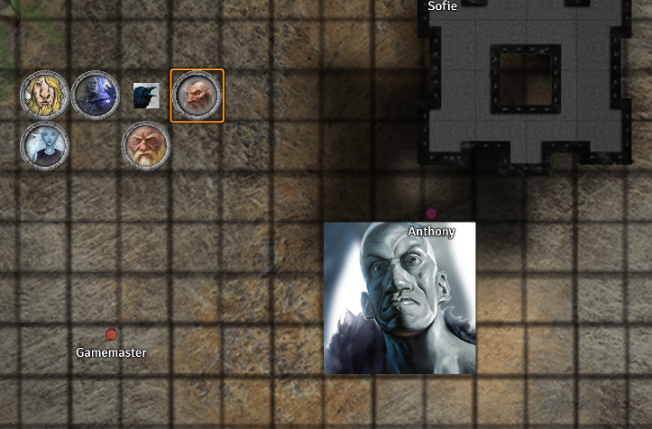

# Session 6

Date of session: **23/06/2021**

- [X] Anthony
- [X] Carl
- [X] Martijn
- [X] Sofie
- [X] Tom

**Disclaimer**: geen spellcheck of grammar check

## Face to face with a demon

Wanneer we in de throne room komen om te gaan rusten bij de **Duergar** (waar we denken dat het veilig is), staan we oog in oog met een demon!  

De zwarte obsidian poort staat open achter de demon.

Terwijl ik binnen wandel krijg ik twee boodschappen binnen:
1. Het is een fiend, let op
2. Ah toch iemand die in mijn lair wil omgekomen

Als we dichter komen wordt hij aggresief.

 Roll for Initiatve

Na de fight treffen we een stunned **Jasper** aan.  
**Jade** gaat hem wakker schudden.

**Sargon** loop alleen op de kamer af.  
Vanaf hij de kamer binnen gaat, overvalt er een lichte druk hem. (die voel ik ook)

Tegen de zuidelijke muur hangt een tapestry met daarop afbeeldingen van dwergen.  
Afgebrokkeld, moeilijk iets uit op te maken.  
Aan de oostmuur staat een spiegel.

Een omschrift rond de spiegel:
"De poort kan zich niet verstoppen voor degene die hij niet ziet."

**Jade** staat voor de spiegel.  
**Alvyn** roept: "Nee, niet voor de spiegel staan!"

**Jade** raakt de spiegel aan.  
Er gebeurt niks.

**Jasper** breekt het tapestry af.  
Gelukkig sta ik niet in de kamer wanner dit gebeurde.

**Sargon** herstelt het tapestry met:

  Mending

er is een dwarven kingdom afgebeeld dat zich onder de berg bevond.  
Het is een afbeelding van clan **Melairkyn**.

**Jade** is trots op haar tattoo.

We leggen ons allemaal neer en gaan een long rest doen.  

**Alvyn** maakt aanstalten om de obsidian deur dicht te doen.

 Strength Check: 9

**Jasper** komt hem tegen dat hij probeert om de deur dicht te trekken.  
**Jasper** probeert hem tegen te houden.  

**Alvyn** wil de deur nog altijd dicht doen.  

 Long Rest

De rest verloopt probleemloos.
**Sargon** en ik krijgen 20 temp hit points en voelen ons aangesterkt.

De spiegel gaat open en er opent een portal.  
We zien een andere kamer aan de andere kant.
**Alvyn** wil door de spiegel wandelen, maar dat lukt niet.  

De kamer aan de andere kant ziet eruit als een oud laboratorium. Instrumenten en skeletten van beesten.  

**Jasper** wil me onzichtbaar maken.  
Ik ga akkoord en probeer door de spiegel te gaan.  
Ik strompel eerst wel over iets wat ik niet kan zien.  
Er komt enkel een soort ripple op de spiegel.

We wandelen terug naar level 5 om dan naar level 7 te wandelen.

## Pressing on to level 7

We wandelen door level 5 (daar is het avond).  
Als we de draak passeren, horen we een gesnurk.

Als we door de gangen lopen, komen we een skelet tegen.  
Hij heeft maar 1 arm. De andere arm wijst naar een ander pad.

Ik vraag aan **Jade** wat er aan de hand is met haar tentacles.  
Ze doet er heel mysterieus over.  
Ze heeft een speciale tattoo.  
Maar ze zegt dat het OK is.

**Jade** vraagt aan **Sargon** of hij nog iets weet van vroeger.  
Hij kijkt haar heel vreemd en vragend aan.  

## Level 7 - Maddgoth's Castle

We volgen een lange gang die in een grottenstructuur uitkomt.  

### 1

In een kamer waar we uitkomen, zien we een op de grond in een kamer een hele hoop "vellen" van een ander wezen liggen.  
We zien er hier veel liggen.

 Nature Check: 18

Het gaat om de carapaces van *Umber Hulks*.  
Dat zijn dezelfde beesten waar **Jade** unconscious is tegen gegaan.

### 16a

We komen aan een grote put.  
Een stijle klif.
**Jasper** ziet in de verte een klein kasteeltje in de put staan.  
Voor de rest zien we niet meteen gevaar.

We dalen de cliffs af naar beneden.

## 16b

Als we beneden aangekomen zijn, zien we de lichamen van 2 dode *Umber Hulks*.  
Ze zien er relatief vers vermoord uit.

Als we dichter bij het kasteel komen, zien we dat het groter wordt.  
**Jasper** ziet in de verte een hele grote humanoid rondlopen, die op zoek is naar iets.  

 Stealth Check: 13

De giant keek in het rond.  
Zijn oog valt op ons, en hij roept iets in het giant.  
Niemand van ons kan het verstaan.  
Hij brult en komt op ons afgelopen.  

 Roll for Initiatve

Ik probeer hem te kalmeren.  
Ik doe teken dat ik hem nie versta en dat we niet willen vechten.  

Hij blijft ons aanvallen.  
Hij gooit massive stenen naar **Jasper**.

We verslaan de giant we staan voor de ingang van het kasteel. (dat nu ondertussen imens is geworden)

We benaderen de deur van het kasteel.  
Het kasteel is ongeveer 600ft hoog.

We zien een groten houden deur.
Aan de deur hangt een gemaakt bordje met in het draconic:

> Otto's Kasteel

**End of the session**
