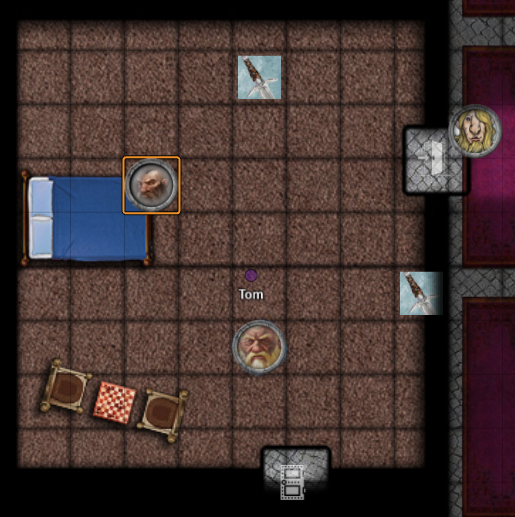
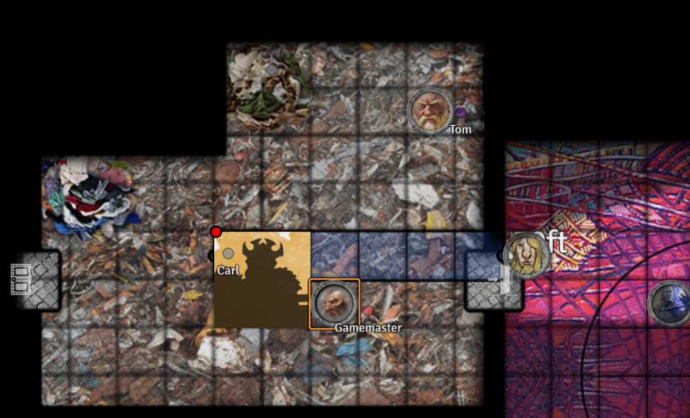
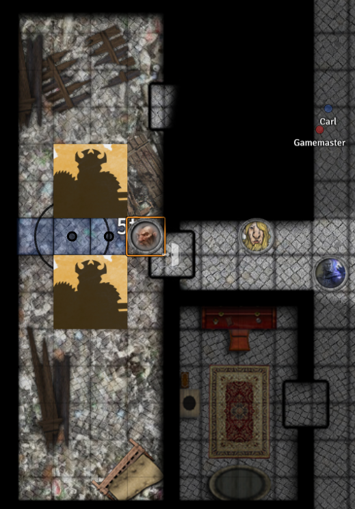

# Session 7

Date of session: **18/08/2021**

- [X] Anthony
- [X] Carl
- [X] Martijn
- [ ] Sofie
- [X] Tom

**Disclaimer**: geen spellcheck of grammar check

## Standing in front of the gates

We benaderen de deur van het kasteel.  
Het kasteel is ongeveer 600ft hoog.

We zien een groten houden deur.
Aan de deur hangt een gemaakt bordje met in het draconic:

> Otto's Kasteel

## Entering the Castle

 Perception Check: 13

We horen geveeg van een magische bezem die pilaren aan het afstoffen is.

Op de pilaren staan groene flessen.

Ik probeer de bezem vast te houden.  
Hij verzet zich.

Ik laat hem in het midden van de kamer weer los.  
Hij blijft even stil staan.

Ik excuseer me tegen bezem en dan gaat die verder met afstoffen.

## Kamer 2

Een ijzer omringde deur met daarin een glazen paneel.  
Een loden raam met een figuur.  

We openen de deur.  
We horen een sirene door de gang klinken.

De deur tegenover ons zit op slot.  

We lopen verder de gang in.  
**Jasper** voelt een getik op zijn schouder.

  Divine Sense

Ik voel geen aanwezigheid van Good or Evil.  

## Dining hall

Ik open een deur en staan in een dining hall.  
Vanaf ik de deur binnenkom, rinkelt er een belletje.  
Een aandere deur opent zich en borden enzo beginnen de tafel te dekken.  

 Perception Check: 16

Ik ruik een lekkere geur uit de keuken komen.

De tafel wordt gedekt voor 12 personen.  
Ik, **Alvyn** en **Sargon** zetten ons aan de tafel.  

De stoel naast **Alvyn** schuift naar achter.  
**Alvyn** tast rond om te voelen of er iets is.  
Hij voelt langs de zijkant een hand.  

**Jasper** vertrouwt het niet en gaat niet zitten (ongemanierd?)  
Ik noteer weer in mijn boek terwijl het eten klaargemaakt wordt.

**Alvyn** cast:

  Faerie Fire

 Dexterity Save: 6

Er komen allerlei schotels uit de keuken.  
Ik neem eten en begin eraan te ruiken.  

**Alvyn** neemt een hap en het is het lekkerste wat hij in lange tijd heeft gegeten.  
Geen vreemde smaken.  

**Sargon** en ik beginnen na het akkoord van **Alvyn** ook te eten.  

Ik leg *5gp* op de tafel als tip.  

Achterin is de keuken, daar moeten we niet zijn.  

De tafel wordt afgeruimd.

Gesloten deur tegenover de dining hall.

## Kitchen

We zien dat ze bezig zijn met de afwas.  
Ik excuseer me en doe de deur terug.

## Brick factory?

Een ruimte met werkbalken.  
Een oude oven is in de muur ingebouwd.  
Op de tafels liggen oude brokken/stenen.  

Als dwerg merk ik dat de stenen geen steen zijn, maar wel dat het klei is.  
De mal ligt er nog, het zijn bakstenen.

## Warehouse

3 stapels kleien legoblokken.  

## Hallway

Als ik de kamer uitwandel, voel ik een tik op mijn schouder.  
Ik roep wie het is, geen antwoord.

## Empty room

als ik de deur open doe, hoor ik iets op de grond vallen.  
In de deuropening ligt een *gold coin*.  

# 1st Floor

We nemen de trap naar de volgende verdieping.

## Hallway

We komen in de gang, we horen een lichte echo door de gang van een alarm dat afgaat.  
Deze hallway is versierd met paarste tapijten met gouden trim.  
Met hout geframde portretten van wizqrds liggen op de grond.  
Rode beklede stoelen staan tegen de muur.

## Bedroom 1

Een zilveren muntje valt op de grond.  
**Alvyn** neemt het mee.

Een bed, nachtkastjes. een kleine boudoir staat tegen de muur.  
Daarop ligt een fles met een modelschip erin.  
Een longboat. Op de fles zit een kurk. Heel veel details.  
**Sargon** neemt het schip mee.  

## Courtyard

Door de bars zien we het Courtyard met een standbeeld van een gezette wizard.  

De deur waar ik nu voor sta staat een grote "M".  
Ik klop aan, ik hoor gesnurk.  

## Bedroom 2

Een groot bed staat in de kamer.  
2 stoelen met in het midden een schaakspel.

De muren zijn bedekt met 6 schilderijen.  
Van een vrij gezette wizard die aan het lachen is en heeft een magical wand.  
Dezelfde als het standbeeld?  
Moeilijk te bepalen. Maar ja.  

Een deken gaat omhoog en omlaag.  
**Sargon** ziet langs de zijkant geen hoofd ofzo.  
Ik trek het deken van het bed.  
Het is volledig leeg.

 Roll for Initiatve

Uit de schilderijen worden 2 wands actief en er komen *Maggic Missles* op me af.  

De wands komen tot leven.  

**Sargon** to the rescue met *Spirit Guardians*.  
Na de combat cast ik:

  Prayer of Healing (16)

**Sargon** is aan het nadenken of hij delen van of het hele schaakspel mee te nemen.  
Alles staat in startpositie.  

## Closset

Vol met mantels, slaapkledij, slippers, ...  
Schoenen op een schoenenrek.

## Control room

Een platinum coin valt op de grond.  
Aangezien **Alvyn** het vorige kreeg, neem ik dit mee.  

Een ijzeren console met daaraan 3 hendels met opschiften.  
1. Courtyard (beneden)
2. Licht (beneden)
3. Heat (boven)

Ik trek de hendel van licht naar boven.  
De kamers en gangen lichten op.

**Sargon** vertrouwt het niet.  
Ik doe de hendel weer omlaag.  
Alles is donker.  

Ik doe de *Courtyard* naar boven.  
We horen of merken niets.

Pentagram met 5 knoppen.
1. Muziek
2. Dak
3. Mist
4. Lockdown
5. Niet op drukken

Ik druk op de knop muziek.  
We horen dat de kamers en de gangen met een aangename muziek gevuld worden.  

Ik hou het hierbij.  
Ik wil het huis niet helemaal ontregelen.  

**Alvyn** voelt op zijn rechterschouder tikken.  
Hij deelt het mede.  

## Library

Rekken vol met papieren in mapjes staan hier.  
Georganiseerde Chaos.  
Als we de documenten doorbladeren zien we vaak het woord overleden staan *lich*.

De namen die ik herken doen me een belletje rinkelen.  
Ik heb ervan gehoord tijdens vorige avonturen.  
Bij sommige staat diseased, *lich*, ...  

Ook een heleboel namen die ik niet herken.

**Gesloten deur** in de kamer.

## Costume room

Ik verschiet me rot.  
Er staat in mijn ooghoek een *mind flayer* staan.

Ik spoort **Sargon** aan om binnen te gaan.  
Het beest is geen echte *mind flayer*, maar een costuum.  
In de rest van de kamer liggen nog meer costuums.  
**Sargon** krijgt het niet aan.  

**Sargon** neemt het costuum mee.

# 3rd Floor

We komen in de gang, we horen een lichte echo door de gang van een alarm dat afgaat.  

Het lijkt hier op een
De vloer is gemaakt van gekleurd glas.  
Het is wel stevig om op te lopen.  

De deur tegenover mij is op slot, maar door een gebroken paneel kan ik kijken:  
Ik zie 2 vleermuizen fladderen.

## Statue room

Er valt een zilveren munt op de grond.  
Ik geef het aan **Alvyn**.

Verderop in de kamer zie ik een groot standbeeld staan.  
Het standbeeld kijkt naar een grote spiegel met daarboven een gegraveerde tekst.

"Tuoyaw" (Way out omgekeerd)

Er hangen een 4 tridents.  

Ik en **Sargon** vertrouwen de tridents niet.  

Het standbeeld is van een murfolg.  
Het is maar half af.

Op de deur er tegenover staat geschreven op de deur (in het draconic):

> Humunculi unwelcome

**Sargon** deelt het mee met de groep.  

Vanuit de kamer horen we gerommel.  
Alsof iemand rommel aan het maken is.

## Rommel kamer

Een vrij groot beest staat in het midden van de kamer.  
Een 12 foot, Humonculus houdt een tafel vast.  

Een gouden munt valt op de grond.  

Een hele hoop rommel ligt door de kamer.  
Tafels enzo zijn volledig overhoop gesmeten.  
Voor de rest nog kaarsen, paddestoelen, lampjes.  
Een hele hoop.  

Volgens **Sargon** is er een geheime deur.  
De andere deur in de kamer gaat open en we horen een laag stemmetje uit de deur komen:

> Otto vindt jullie leuk. Jullie hebben Otto geholpen met de Homonculus.

Hij wil zich niet laten zien, is verlegen.  

> Otto wil een deal: als we trinkets geven wil hij ons helpen.

Hebt gij de muntjes tussen de deuren gestopt?

> Ja om te zien waar de homonculus zit.

> Otto is geen goeie vrinden met de homonculus.

Weet gij van de geheime deur?

> We horen niks.

Hij dreigt om de deur dicht te houden.

Zijt gij ons in de maling aan het nemen?

> Ja dat was ik. Dat was toch grappig?

Hij wil zich niet laten zien.  
Als we van de deur weg gaan, wil hij zich wel laten zien.  

Wat is hier nog te zien Otto?

> Veel te zien. Kijk maar rond er is vanalles. Hij is overal geweest. Het is nu mijn kasteel.

We gaan naar de andere kamers. We laten de secret room voor wat het is.

## Empty room?

Het glazen panneel ontbreekt.  
Lege kamer met spinnenwebben.

## Throneroom

In het midden een grote ijzeren met stained glass beklede troon.  
De troon kijkt naar de deur.  
De armleuningen en voeten lijkt alsof hij om klauwen staat.  

Een cikelvormig tapijt met een grote gapende mond ligt voor de troon.  

## Burnt room

Verkoolde stukken hout.  
Verbrande/verkoolde spullen in de kamer.

Volgens mij is er een brandje onstaan.

##

Een zilveren muntje valt op de grond.  

Verschillende tafels staan willekeurig in dek amer.  
Schedels hangen aan de muur.  
potten met beenderen staan in de kamer.  
Gebroken glas ligt verspreid in de kamer.  
Er liggen alchemist supplies waar **Alvyn** naar toe getrokken is.  

Zijn oog valt op een flesje dat in de kamer staat.  
volledig dooschijnend, maar er lijkt iets in te bewegen.  
**Alvyn** pakt het flesje.  

  Identify

Het blijkt een *Potion of Invisibility* te zijn. (**Alvyn**)

## Empty room 2?

Het glazen panneel ontbreekt.  
Lege kamer met spinnenwebben.

Wat doet **Otto** elke dag

> Reuzen ampeteren, grappen met reizigers uithalen. Trinkets zoeken.

Hij heeft al lang geen bezoek meer gehad.  

Wie is die tovenaar hier?

> Hij heeft geen idee?

We openen het luikje naar het dak.

# Roof

Een heleboel kantelen op het dak.  
Er is vrij weinig zien.

# Back to the 2nd floor

## Bedroom 3

Houtskool geur.  
Een overtrokken bed, met hemel.  
De gordijnen zijn zwart, en allemaal dicht.  

Een aantal tafels, een kleerkast en een kleine kast.  

Een verkoold lichaam ligt in het bed.  
Een stukje wand ligt er. Het bed zelf is nog pristine.

Verkoolde robes liggen rond hem.  
Onder zijn hand ligt nog een klein houten stompje.

**Alvy**:

 Investigation Check: 30(!)

Hij weet dat het van een **Aggorax Darksworn** is aan het embleem vanonder aan de wand.

**Otto** wie is dit?  
Geen antwoord

## Archive room

WE vinden een mapje met daarin info **Aggorax Darksworn**. Zijn status is deceased.  
Als we erdoor lezen, weten we wat hij allemaal gedaan heeft. Hij was een vrij sterke *Wizard*.  

Ik heb het gevoel dat de eigenaar van het kasteel de mage is. Die is niet thuis, en is ontzettend krachtig en vermoord andere sterke *Wizards*?  
Heeft hij **Aggorax Darksworn** vermoord en bijgehouden?  

## Bedroom 4

Een koperen munt valt op de grond.

Twee aparte bedden.  
Twee kisten achter de bedden.  
Achter de bedden een groot zandstenen schijf met daarop een Medusa gelaat.
In het midden een ligbank.  

De kisten zijn allebei leeg.

## Bedroom 5?

Een electrum muntje valt op de grond.  

Een grote spiegel staat aan een van de muren.  
Een comfortabel bed.  
Een kast staat tegen de muur.  
Kist, nachtkastjes rond het bed.

Alles is leeg.

Gravering in de poort:

> Hand die een brandende fakkel heeft.  

De spiegel wordt geactiveerd.  
Herkennen we de andere kant?

Nee, we zien aan de andere kant een grot.  

We kunnen niet door de poort.  
We voelen ons niet klaar.

# 1st floor

## Lege kamer

Zilveren muntje valt op de grond.

## Bathroom

Een ingebouwde spiegel.  
Haarborstels, parfums, ..
WC en bad.  

Een gouden WC pot staat in de kamer.

## Courtyard

In het midden zien we een standbeeld staan van een *Wizard*.  
Het komt overheen met de schilderijen die we gezien hebben.  

Inscriptie:

> Maddgoth

## Ambush

Twee Humonculus staan in de kamer en lopen op mij af.  

 Roll for Initiatve

De kamer ligt helemaal overhoop alsof de humonculi alles afbreken?  

Ze zakken allebei als een pudding in mekaar.  

## Trophy room

Panelen in de deur zijn gebroken.  
In het midden van de kamer staat een ijzeren kist.  
Tegen de muur zijn bepleisterde wands, staffs, rods en orbs hangen.  
Een kleine spiegel met een stenen frame hangt tegen de muur.  
Een stoel en tafel (gemaakt van boeken) staan tegen de muur.  

**Sargon** opent de kist, maar die zit op slot.  
**Alvyn** probeert het slot weg te branden met zuur.  
Het zuur bijt de oxidatie weg, maar kan niet door het slot bijten.

**Alvyn** onderzoekt de wands en orbs.  
Hij kan niet meteen linken van wie de spellcasting focussen zijn.  
Het valt hem op dat de stoelen en de tafels meer opvallen.  
Hij bekijkt ze en ziet dat het allemaal spellbooks.  

## Rommelige kamer

Een koperen munt valt op de grond.  
Een grote rommelige kamer is voor ons.  

## Chest room

Electum muntje valt op de grond.  
Veel kisten staan netjes op mekaar gestapeld.

Er staat een spiegel in de kamer met een gravering:

> "Wat komt 1 keer voor in een blauwe maan, 2 keer in een uur, maar nooit in een zonnestraal."

**Sargon** en **Alvyn** lossen het meteen op en roepen: "U"

De spiegel activeert.  
We zien een bureau, met een aantal tapijten.  
Tegen de muur zien we koperen buizen.

**Alvyn** loopt weg.  
Ik kan nog niet door de poort lopen, want we zijn nog net niet sterk genoeg.

**End of Session**

Open Vraag:

# Wat doen we met Otto?
