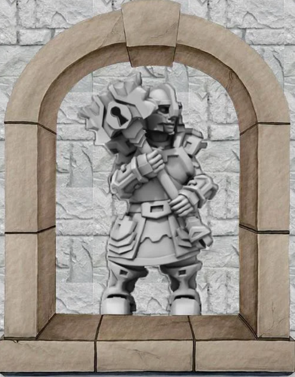
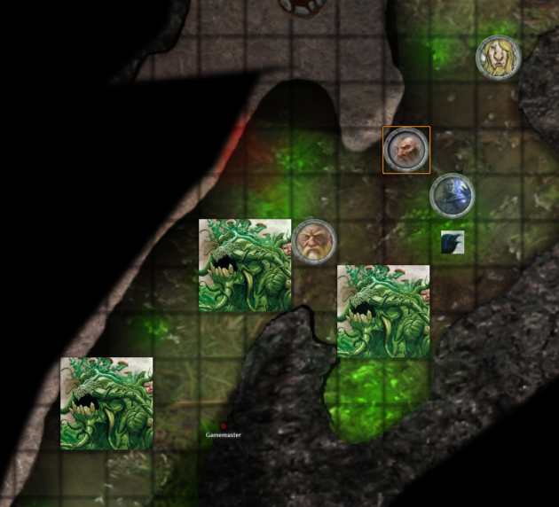
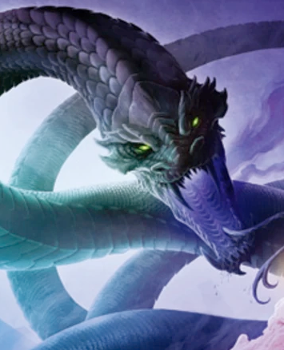

# Session 8

Date of session: **29/09/2021**

- [X] Anthony
- [ ] Carl
- [X] Martijn
- [X] Tom

**Disclaimer**: geen spellcheck of grammar check

## Leaving the castle

Is **Otto** nog bij ons?
Ik vraag het in de kamer, maar krijg niet meteen antwoord.

We besluiten om het kasteel te verlaten, want volgens **Sargon** is er niks meer te zien.

## Crystals

In het midden staan 3 mooie kristalformaties die uit de grond zijn ge-expldeerd.  
Rondom liggen afgebrokkelde kristallen.

**Jasper**, zien de kristallen er expensive uit?

**Jasper** waarschuwt ons voor een hagedis die met zijn zij naar ons staat.

De kristallen zijn kwetsbaar. Ze brokkelen ze af terwijl ik ze onderzoek met mijn handaxe.

**Jasper** staat ondertussen bij een standbeeld?  
Maar als hij eenmaal in de buurt komt ziet hij dat het een versteende basilisk is.

Tijdens zijn aanval lijkt hij versteend te zijn.  
Hij wou ergens naar grijpen en iemand zorgde ervoor dat hij zichzelf versteend heeft.

> Zit hier misschien een slim beest dat die basilisk heeft verslagen? Misschien Otto wel?

We raadplegen de kaart.  
Naar level 8 we go!

# Level 8

Terwijl ik vooruit wandel, hoor ik in ene keer achter me een echo:  
"Wacht even, er zijn hier heel veel traps" **Sargon**

Ik sta aan een klif, in de verte ligt een moeras.  
Het is ongeveer 20ft (6 meter) naar beneden.  
Er is aan de zijkant een ladder tot in het water.  Die ziet er wel slijmig uit.

  Mending

**Sargon** pakt de ladder vast en moet een save doen.

 Constitution Save: 17

**Sargon** klimt naar beneden.  
Hij zit tot aan zijn knieën tot in het water.  

**Jasper** is ook zonder problemen beneden.  

**Svenn** en **Alvyn** halen het ook zonder problemen.

**Jasper** kijkt via **Tal** en ziet een kikkerachtig iets van ons weglopen door het water.  

## Portal Cave

In de middelste vinger van de "klauw" staat een poort.

Een dwerg is gesteenhouden in de poort met een grote warhammer met daarin een sleutelgat.  

Ik probeer de sleutel (zie session 2).  
Het werkt niet, er gebeurt niks.  

**Sargon** heeft nog een stenen sleutel.  
Hij steekt die erin en de poort gaat open.

Door de poort kijken we recht op een andere poort.  

Ik stap door de poort.

Ik rol een d6 (3).

**Sargon** probeert me terug te roepen.  
Ik zie hem het proberen zeggen tegen mij.

Ik stap weer terug door de poort.  

De poort komt op level 6 (waar king **King Melair** ten rusten ligt)

**Sargon** maakt zich veel zorgen om de sleutel.  
Hij panikeert dat we niet meer de poort kunnen open doen.  

De poort sluit en de sleuter verschijnt weer.  
Er is een inscriptie op de sleutel te zien:
"Meet me on the **Lost level**, find my twin in **Slitherswamp**"

**Lost Level** = Level 6  
**Slitherswamp** = Level 8  

## Back to the swamp

**Sargon** duwt **Alvyn** in de swamp, hij valt met zijn gezicht erin.  
Hij gaat het onthouden!  

In de verte zien we mos op de wanden van de gang groeien en dat begint op te lichten.  

Verderop is een kleine klif waar we eventueel op kunnen klimmen.  

De klif is 20ft (6 meter) hoog, dus we kunnen niet omhoog klimmen.  

Ik snij een beetje mos van de muur, maar het dooft heel snel uit.  

Terwijl we door het gebied wandel, loopt **Sargon** op kop.  
**Sargon**, terwijl hij door het kniediepe moeras wandelt, wordt door 2 kanten aangevallen.  
Uit het moeras komen dingen naar boven alsof de planten leven.  

A fight breaks out.

 Roll for Initiatve

**Alvyn** is toxic en doet friendly fire op **Sargon**.  
Wel een reden voor, want **Sargon** noemde hem lelijk en groen.  

De shambling mounds smelten weg in het moeras het lijkt alsof we ze niet meer zien.

  Prayer of Healing

**Sargon** probeert meerdere keren om de muur op te klimmen, maar het lukt hem totaal niet.

Op de moment **Sargon** eindelijk boven geraakt is, gooit **Jasper** zijn touw naar beneden.

Boven zien ze een plas bloed liggen.  
De stenen waren doordrenkt, waardoor **Alvyn** viel tijdens het klimmen in het water en is helemaal nat van het moerassap.  

Er ligt een lijk van een Duergar boven, met het been eraf gehakt.  
Heeft een lederen tas bij zich:  
- Gegraveer stenen standbeeld van een uil
- ~220gp~ (verdeeld onder 4)
- Boek

**Sargon** bladert door het boek, er is weinig tekst in te vinden.  
Wel een ruw getekende kaart van gebied 1 tem 6.  
Verschillende notes:
- Frog people to the north-east
- Serpents with foul magic to the south-east

Daarna staat een vrij uitgebreid plan hoe hij zijn allies wil gaan zoeken die hem kunnen redden met zijn neef van de magic serpents.

Ik sping super vlot op de klif.  
Ik steek het vuur aan.  

We horen geecho van kikker die door het moeras aan het kwaken zijn.  
We zien muggen en beesten op ons vuur afkomen.  

**Long Rest**

## Moving to the altar

Na de long rest, spingen we naar beneden en gaan we verder in richting het altaar.  

We benaderen een klein eiland.  
De grot wordt veel groter en hoger. (50m)  
Scherpe punten hangen aan het plafond?  

Op het eindlandje staan oude ruines en een standbeeldje.  
Als we in de buurt komen, zien we iemand rondwandelen op het eiland.  
We kunnen er zowat doorkijken...  
Maar ziet er wel menselijk uit.  
Man, zwaard, plate armor.  

Hij kijkt rond alsof hij de weg kwijt is.  

**Sargon** gaat richting het spookachtig ding.  

"Hallo" - **Sargon**  
De spook wandelt naar de zijkant, reageert niet op hem.  

Het standbeeld in het midden is een serpent.  
Een opgekreukelde/opgerolde slang.  

Het spook negeert ons compleet, rude.  

Ik raak het standbeeld aan.  
Er gebeurt niks.  

Het is een net, degelijk standbeeld maar niet meteen waardevol.  

  Detect Magic

Er komt een lichte gloed van het standbeeld af.  
Lichte paarse gloed = Necromancy

Is dit de "foul" magic waar het journal over spreekt?  

**End of Session**
