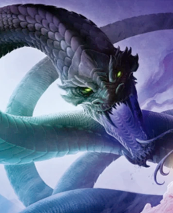

# Session 9

Date of session: **13/10/2021**

- [X] Anthony
- [X] Carl
- [X] Martijn
- [X] Tom

**Disclaimer**: geen spellcheck of grammar check

## Standing at the altar/sacrificial place

In de verte ziet **Jasper** een strand en een gebouw staan.  
**Alvyn** is een beetje in zijn eigen wereld verdwenen.  

**Jasper** loopt op kop.  
Hij zakt stillekes in een diepe put.  
Hij waarschuwt ons voor de put die er is.  
Iedereen kan het ontwijken.  

## Old ruins

In de verte staat een oude ruine in het midden van een grot opening.  
**Jasper** stuurt **Tal** voorop voor een recon te doen.  

De binennmuren zijn gegraveerd met verschillende slangen.    
Zie standbeeld.   

Van het dak blijft niet veel over.  
In het midden van de ruine staat een zwart standbeeld:
- Een gemaskerd persoon met een kap op.
- Human hoogte ongeveer.
- Harnas aan.

2de kamer:
- Grijs standbeeld
- Veel groter van een gevleugelde slang

Als hij de volgende kamer wil uitvliegen om de opening te zien, ziet hij weer een soort spectral woman rondwandelen met een zwart kleed aan.  
Vergelijkbaar met de verdwaalde avonturier.  
Ze kijkt meteen naar de raaf.  

**Jasper** geeft alle informatie door.  

Standbeeld heeft een dolk vast.  
Van het plafond valt er af en toe een druppel water net langs/op de dolk, alsof het gif is.  

 

   
Dit is niet gebeurd.

   
**Alvyn** vangt de druppel op met zijn mond.  
   **Svenn** en **Sargon** houden hem omhoog.

   Er gebeurd niks speciaals, maar het smaakt niet lekker.

 

  Detect Magic

Niet meteen veel magische dingen.  
Alleen **Tal** licht wel op.

De raaf is magisch???  

We gaan naar het andere standbeeld.  
**Jasper** licht ons in dat de spectral woman er nog staat.  
